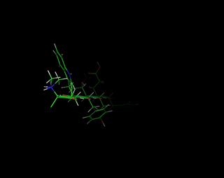
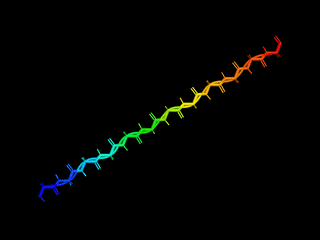

# Pose
A bare metal Python library for building and manipulating protein molecular structures




## Description:
This library constructs a pose for a protein molecule, which is a data structure for that contains relevant information that defines the polypeptide molecule. Primary information includes the XYZ cartesian coordinates of each atom, the identify and charge of each atom, and the bond graph of the entire molecule, as well as other secondary information such as the FASTA sequence of the molecule, the molecule's radius of gyration, potential energy, and the secondary structure that each amino acid belongs to.

Using this information, the pose can build (**canonical** and **non-canonical** amino acids, including both **L-amino acids** and **D-amino acids**) and manipulate polypeptides, such as building any polypeptide from sequence, move the torsion and rotamer angles, mutate residues, as well as measure the bond lengths and angles. This data structure can be used to build higher level protocols such as simulated annealing, and machine learning-based protein design.

> __Note__
It is important to note that this library uses **zero-based array indexing**, NOT one-based array indexing as is in the PDB. It is thus important to note that the first amino acid and the first atom is indexed as 0 and not 1.

## List of available amino acids:
|||||||||||
|-|-|-|-|-|-|-|-|-|-|
|A - ALA|B - LYX|C - CYS|D - ASP|E - GLU|F - PHE|G - GLY|H - HIS|I - ILE|J - MSE|
|K - LYS|L - LEU|M - MET|N - ASN|O - PYL|P - PRO|Q - GLN|R - ARG|S - SER|T - THR|
|U - SEC|V - VAL|W - TRP|X - TRF|Y - TYR|Z - TSO|

## Installation:

For pip:

```bash
pip install git+https://github.com/sarisabban/Pose
```

For anaconda:
```bash
conda create -n ENVIRONMENT python=3
conda activate ENVIRONMENT
pip3 install git+https://github.com/sarisabban/Pose
```

## Example code:
```py
from pose import *

pose = Pose()
pose.Build('SaRi')
pose.Export('output.pdb')
```

> __Note__
Capital letter unicodes will build L-amino acids, small letter unicodes will build D-amino acids.

### Description of the AminoAcid.json:
| Dictionary Key | Value Type    | Description of Values |
|----------------|---------------|-----------------------|
|Vectors         |List of lists  |The position of each atom relative to the N of the backbone. If the N coorinate is X, Y, Z = 0, 0, 0 you will get these vectors. To find the correct vectors position the N at coordinate X, Y, Z = 0, 0, 0, and use the corresponding coordinates of each atom|
|Tricode         |String         |The three letter code for each amino acid|
|Atoms           |List of lists  |The atom identity of each coordinate point, first coordinate point is the nitrogen with symbol N and PDB entry N, next atom is the hydrogen that is bonded to the nitrogen with symbol H and PDB entry 1H etc... Unlike the PDB where all hydrogens are collected after the amino acid, here each atom's hydrogens come right after it. This makes for easier matrix operations. Order is index [0] == PDB atom's name, index [1] == element, index [2] == charge, index [3] == temperature factor|
|Chi Angle Atoms |List of lists  |The atoms in the sidechain that are contributing to a chi angle|
|Bonds           |Dictionary     |The bond graph as an adjacency list|

### Description of the polypeptide's data structure:
| Dictionary Key | Value Type | Description of Values |
|----------------|------------|-----------------------|
|Energy          |Float       |The potential energy of the molecule|
|Rg              |Float       |The radius of gyration of the molecule|
|Mass            |Float       |The mass of the molecule in Daltons|
|Size            |Integer     |The sequence length of the molecule|
|FASTA           |String      |The FASTA sequence of the molecule|
|Amino Acids     |Dictionary  |The key is the index in sequence, the value is the amino acid symbol, chain, backbone atom indices, sidechain atom indices, and the secondary structure the amino acid belongs to|
|Atoms           |Dictionary  |The key is the index in the coordinates matrix, the value is the atom's PDB symbol, the element symbol, the charge, and the temperature factor|
|Bonds           |Dictionary  |The bond graph of the molecule as an adjacency list|
|Coordinates     |Numpy array |The XYZ cartesian coordinates of each atom|

## Table of methods:
| Method                                          | Description with example |
|-------------------------------------------------|--------------------------|
|pose = Pose()                                    |Construct the Pose class|
|pose.Build('SARI')                               |Build a polypeptide using a sequence, the polypeptide will be in primary structure. Example: the sequence 'SARI'. Capital letters for L-amino acids, small letters for D-amino acids|
|pose.Import('1tqg.pdb', chain='A')               |Import a structure from a .pdb file specifically chain 'A' of the complex (if no hydrogens are in the PDB they will not be added). To add Hydrogens use pose.ReBuild() after pose.Import() to re-build the structure with Hydrogens (there will be slight variation in the sidechains). Cannot use structures with broken non-continuous chains|
|pose.ReBuild()                                   |Build the sequence of the polypeptide it as a primary structure then re-fold it using its amino acid angles and bond lengths|
|pose.Export('out.pdb')                           |Export the polypeptide to a .pdb file. Example: the output file's name is out.pdb|
|pose.Mutate(1, 'V')                              |Mutate an amno acid. Example: Mutate second amino acid to become Valine|
|pose.Angle(2, 'chi', 1)                          |Get the PHI, PSI, OMEGA, or CHI 1-4 angles of an amino acid. Example: second amino acid's CHI 1 angle. For the PHI, PSI, and OMEGA angles no need to include the second argument (the 1 in this example)|
|pose.Rotate(2, 20, 'chi', 1)                     |Change an angle to reach a degrees. Example: third amino acid, change angle to become 20 degrees, the angle type is CHI 1|
|pose.Atom3Angle(0, 'N', 0, 'CA', 0, 'C')         |Get the angle between any three atoms in any amino acid. Example: first amino acid's Nitrogen, first amino acid's Carbon alpha, and first amino acid's Carbon|
|pose.Rotation3Angle(1, 'N', 1, 'CA', 1, 'C', -2) |Add/Subtract any three atom backbone angle from current degrees. Example: second amino acid, subtract 2 degrees from the N-Ca-C angle|
|pose.Distance(0, 'N', 1, 'CA')                   |Get the distance (in Å) between any two atoms in any amino acid. Example: distance between first amino acid's Nitrogen atom and second amino acid's Carbon alpha atom|
|pose.Adjust(0, 'N', 0, 'CA', 10)                 |Adjust the distance between any two atoms in any amno acid. Example: distance between first amino acid's Nitrogen and first amino acid's Carbon alpha to become 10 Å. The order of the atoms makes a difference, (0, 'N', 0, 'CA', 10) ≠ (0, 'CA', 0, 'N', 10), useful to seperate the chain behind the N|
|pose.GetBondAtoms(0, 1)                          |Get the atom pair that participate in a bond from their index. Example: atom index 0 and atom index 1 return ['N', 'N', 'HA', 'H'], this returns both atom's PDB name and the element's name|
|pose.GetAtom(3, 'N')                             |Get XYZ cartesian coordinates of an atom. Example: fourth amino acid's Nitrogen atom|
|pose.AtomList(PDB=True)                          |Get a list of all the atoms in the polypeptide, use PDB=True to get their PDB formatted names|
|pose.Identify(3, 'atom', q=True)                 |Identify what 'atom' type belongs to a particular index in the coordinates matrix, use q=True to identify the atom's charge, use 'residue' or 'amino acid' to instead identify the amino acid by index in the polypeptide sequence|
|pose.SecondaryStructures()                       |Get a list of each amino acid's secondary structure H:Helix, S:Sheet, L:Loop|
|pose.Info()                                      |Print all the information about the polypeptide in an organised printout|
|print(pose.data)                                 |Print the dictionary data structure where all the polypeptide's information reside|

## For collaboration:
If anyone is interested in collaborating and contributing, these are functions that needs to be added:

0. **Easy**: update Rebuild() to rebuild a structure but with all D-AAs. (how to modify the Phi/Psi angles)?
1. **Easy**: Structure alignment (RMSD between two poses)
2. **Easy**: Sequence alignment (BLAST & MSA)
3. **Moderate**: Calculating Gasteiger partial charges for each atom
4. **Moderate**: Find all H-bonds
5. **Moderate**: Calculate DSSP for each amino acid
6. **Hard**: SASA calculation for each amino acid
7. **Hard**: Pocket and void calculation
8. **Hard**: AMBER energy function + Minimisation
