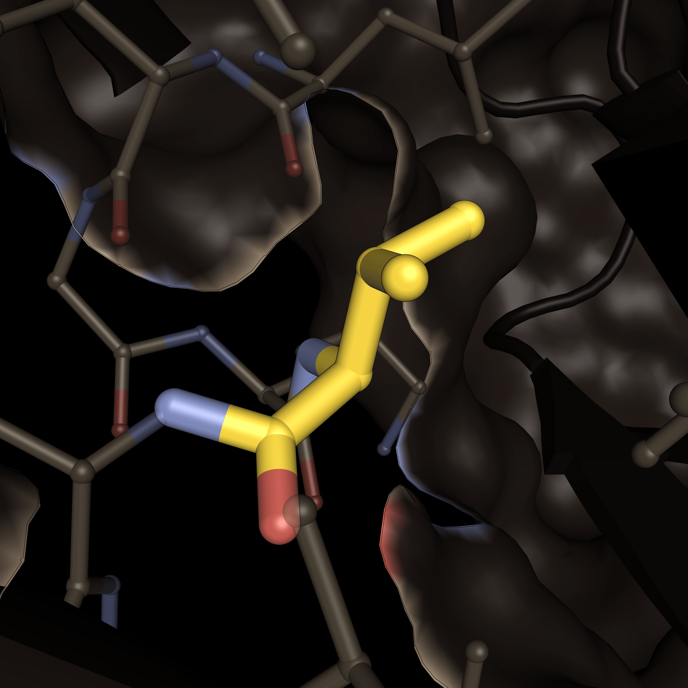
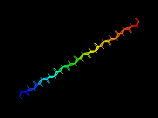
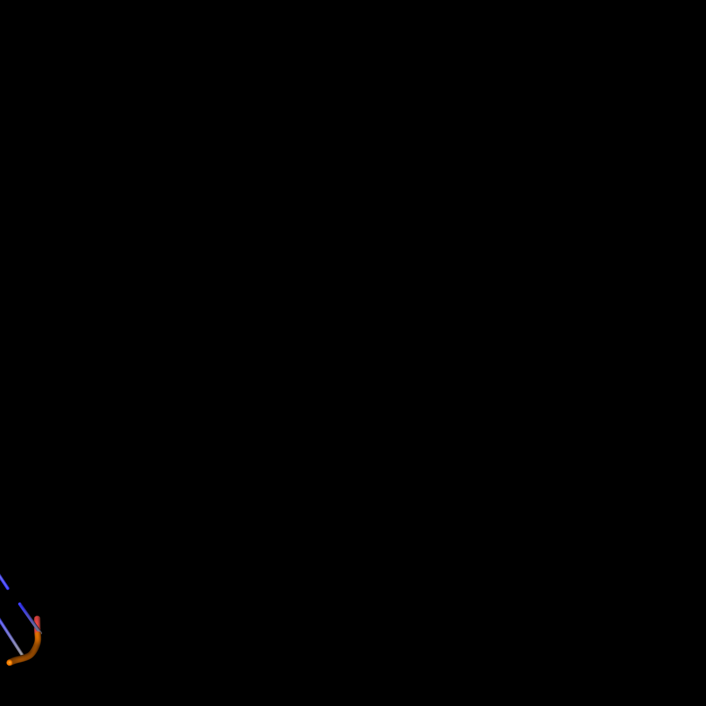
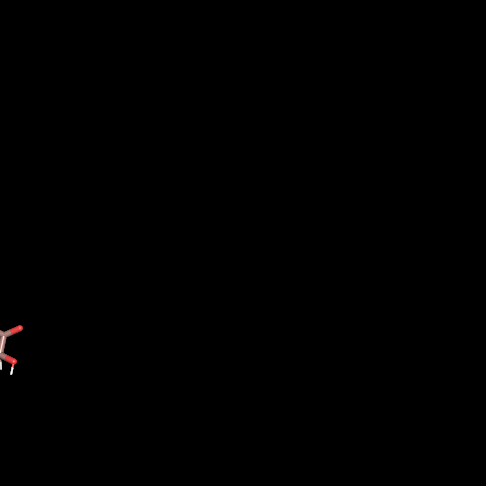
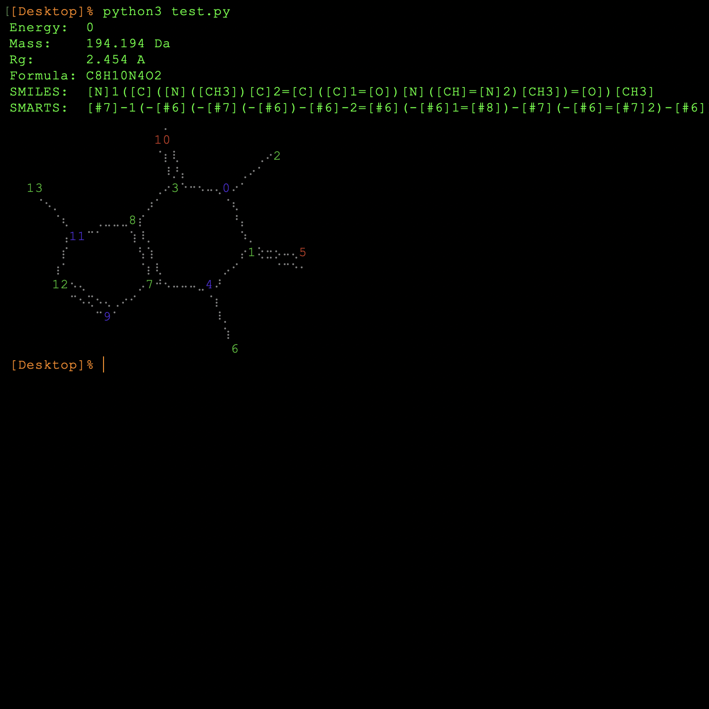

<div align="center">
<pre>
██████╗  ██████╗ ███████╗███████╗
██╔══██╗██╔═══██╗██╔════╝██╔════╝
██████╔╝██║   ██║███████╗█████╗  
██╔═══╝ ██║   ██║╚════██║██╔══╝  
██║     ╚██████╔╝███████║███████╗
╚═╝      ╚═════╝ ╚══════╝╚══════╝
</pre></div>

# Pose
A bare-metal Python library for building and manipulating protein and nucleic acid molecular structures





---

## Video Tutorial

**Watch the full walkthrough:** [Video Tutorial on YouTube](https://youtu.be/r0exhjDjUhs)

---

## What is Pose?

Pose constructs a data structure for protein or nucleic acid molecules that contains all relevant information defining a polymer. Primary information includes the XYZ cartesian coordinates of each atom, the identity and charge of each atom, and the bond graph of the entire molecule. Secondary information includes the FASTA sequence, radius of gyration, potential energy, and the secondary structure assignment for each protein residue.

Using this data structure, Pose can build and manipulate polypeptides and nucleic acids: construct any polypeptide or nucleic acid from sequence, move dihedral and rotamer angles, mutate residues and base pairs, and measure bond lengths and angles. It is designed as a substrate for higher-level protocols such as simulated annealing, molecular dynamics, and machine learning-based molecular design.

**Key features:**
- Designed to be extremely stable bare-metal python: NumPy is the only dependency for the core `Pose` and `Molecule` classes
- 26 amino acids supported by default (20 canonical + 6 non-canonical: LYX, MSE, PYL, SEC, TRF, TSO), can be extended to 100+
- Support for both L-amino acids and D-amino acids (mixed sequences fully supported)
- 5 DNA and RNA canonical nucleotides
- Full bond graph with atom partial charges
- Measure and rotate protein dihedral and rotamer angles (φ/ψ/ω/χ)
- Measure and rotate nucleic acids dihedral angles (α/β/γ/δ/ε/ζ/χ)
- Measure and adjust the distance and angle between any atoms
- PDB and mmCIF file import and export
- Pythonic zero-based indexing throughout (unlike PDB's one-based convention)

---

## Installation

**Dependencies:** Python >= 3, NumPy

For virtualenv:
```bash
pip install git+https://github.com/sarisabban/Pose
```

For anaconda:
```bash
conda create -n ENVIRONMENT python=3
conda activate ENVIRONMENT
pip3 install git+https://github.com/sarisabban/Pose
```

---

## Quick Start

```python
from pose import *

# Build a peptide
p = Pose()
p.Build('MSLESNRGI', chain='A', fmt='protein') # Uppercase = L-amino acids, lowercase = D-amino acids
p.Build('MSLESNRGI', chain='B', fmt='protein') # Add a second chain
p.GetInfo()                                    # Print structured summary

# Inspect properties
print('Sequence:', p.data['FASTA'])
print('Mass:', p.data['Mass'], 'Da')
print('Rg:', p.data['Rg'], 'Å')

# Rotate backbone angles (indices are zero-based)
p.RotateDihedral(1, -60, 'PHI')
p.RotateDihedral(1, -45, 'PSI')

# Mutate and export
p.Mutate(2, 'V')        # Change residue at index 2 (Leu) → Val
p.Export('peptide.pdb')

# Import a protein
p = Pose()
p.Import('1YN3.pdb')
p.GetInfo()

# Import a nucleic acid
p = Pose()
p.Import('1BNA.pdb')
p.GetInfo()

# Build a nucleic acid
p = Pose()
p.Build('ATGCGTACGTTCCGGCAGACGT', chain='A', fmt='DNA')
p.GetInfo()
```

**D-amino acids** — use lowercase letters:
Uppercase sequence letters build L-amino acids (natural form). Lowercase builds D-amino acids (mirror images). Mixed sequences are fully supported.
```python
p.Build('ACEG')   # All L-amino acids
p.Build('aceg')   # All D-amino acids
p.Build('GAg')    # G=L-Gly, A=L-Ala, g=D-Gly
p.Build('AcEg')   # Mixed L/D sequence
```

**Importing a PDB file:**
```python
p = Pose()
p.Import('1TQG.pdb', chain='A')
p.ReBuild()     # Adds missing hydrogens
```

You can run p.ReBuild() after Import() to add hydrogens to the structure. But understand that a new synthetic structure will be built, therefore you will lose the original occupancy and temperature-factor for each atom (replaces with 1.0 and 0.0).

**Importing a molecule:**
```python
m = Molecule()
m.Import('caffiene.sdf')
m.GetInfo()
```

**RDKit plugin:**
```python
from rdkit import Chem

CFF = 'CN1C=NC2=C1C(=O)N(C(=O)N2C)C'
m = Chem.MolFromSmiles(CFF)
# Manipulate a molecule using RDKit here
molstr = Chem.MolToMolBlock(m)

m = Molecule()
m.Import(molstr)
m.GetInfo()
```

This RDKit plugin gives you the power and flexibility to manipulate molecules using RDKit and then import them to the Molecule() class when they are ready.

---

## API Reference

### Call Class

| Class            | Description |
|------------------|-------------|
| `p = Pose()`     | Calls the `Pose()` class for proteins, DNA, and RNA |
| `m = Molecule()` | Calls the `Molecule()` class for small organic molecules |

Each class have similar methods and data structure, but with slight differences in the way they are used.

### Building & I/O

| Method                                                     | Description |
|------------------------------------------------------------|-------------|
| `p.Import(filename='1YN3.pdb', chain=['A', 'B'], model=1)` | Imports a structure from a PDB or mmCIF file and constructs the `p.data` object. Can import a protein, DNA, or RNA structure. `chain` accepts a single chain ID (`'A'`), a list of chains (`['A', 'B']`), or `None` to import all chains. `model` selects which model to import from multi-model files (e.g. NMR ensembles); defaults to `1`. For atoms with multiple conformers, the highest-occupancy conformer is kept. Cannot import a structure that is a mixture of proteins and nucleic acids in separate chains, import each macromolecule type as a separate pose |
| `m.Import(filename='caffiene.sdf')`                        | Imports a structure from a PDB, SDF, mmCIF, MOL, or MOL2 files, or an RDKit block string and constructs the `m.data` object |
| `p.Export('out.pdb')`                                      | Write the full structure, and all chains, to a PDB or mmCIF file |
| `m.Export('out.sdf')`                                      | Write the full structure to a PDB, SDF, mmCIF, MOL, or MOL2 file |
| `p.Build('MSLESNRGI', chain='A', fmt='protein')`           | Build a macromolecule from a one-letter sequence. For a polypeptide add the sequence and choose the format `fmt='Protein'`, uppercase = L-amino acids, lowercase = D-amino acids. For a nucleic acid add the sequence and choose the format `fmt='DNA'` or `fmt='RNA'`. You can add more chains by repeating the command with different chain `chain='A'` values. A structure can either be a protein, or a nucleic acid (DNA/RNA), it cannot be a mixture of the two |
| `p.ReBuild(sequence=None, mirror=False, _mutate=None)`     | Rebuild the polypeptide or nucleic acid. Use `sequence='AGLMTSWVLVA'` to rebuild the structure with multiple bulk mutations on chain A. Use `sequence={'A':'MSLKLSTVVA', 'B':'ASLKSWFWVA'}` to perform mutations at multiple chains at the same time. Use `mirror=True` to rebuild a protein and convert L-amino acids → D-amino acids and D-amino acids → L-amino acids. Will add missing hydrogens. For DNA and RNA, the `sequence=''` length must match exactly the original sequence length, otherwise an error will be raised |
| `p.Mutate(1, 'V'. fast=True)`                              | Mutate a single monomer. For proteins: `p.Mutate(1, 'V')` = residue 1 → L-Valine, `p.Mutate(1, 'v')` = residue 1 → D-Valine. For DNA: `p.Mutate(0, 'T')` = nucleotide 0 → Thymine. For RNA: `p.Mutate(0, 'U')` = nucleotide 0 → Uracil. For double-stranded nucleic acids, the complementary base is also updated automatically. The `fast=True` argument means the mutation is performed by vector addition without ensuring the stability of the backbone (also the `CalcDSSP(), CalcSASA, and CalcRg()` etc.. are not re-computed) so these needs to be called after the mutation, in return the mutation is very fast, ideal for large mutation simulations. If `fast=False` the mutated residue is added to the structure and the entire structure rebuilt using ReBuild(), this is more accurate but very slow for large simulations |


### Measurements
| Method                                       | Description |
|----------------------------------------------|-------------|
| `p.GetDistance(0, 'N', 5, 'CA')`             | Get the distance in Å between any two atoms. Example: residue 0 nitrogen atom to residue 5 CA atom |
| `m.GetDistance(0, 5)`                        | Get the distance in Å between any two atoms. Example: atom 0 to atom 5 |
| `p.GetDihedral(2, 'PHI')`                    | Calculate the amino acid φ/ψ/ω/χ and nucleotide α/β/γ/δ/ε/ζ/χ dihedral angles. In this example we are measuring the PHI angle of the 3rd protein residue (index 2). For protein χ dihedral use `p.GetDihedral(4, 'chi', 1)` 5th residue (index 4), CHI 1 angle |
| `m.GetDihedral(0, 1, 2, 3)`                  | Calculate a dihedral angle between 4 atoms. In this example the dihedral angle is made up of the atoms at indeces 0, 1, 2, and 3 |
| `p.GetAngle(0, 'N', 5, 'CA', 17, 'C')`       | Get the angle between any three atoms in the whole structure. Example: N of residue 1, CA of residue 5, and C angle of residue 17, with the CA atom in the middle being the pivot |
| `m.GetAngle(0, 5, 17)`                       | Get the angle between any three atoms in the whole structure. Example: atom at index 1, atom at index 5, and atom at index 17, with atom at index 5 being the pivot |
| `p.GetAtomBonds(0, 1)`                       | Confirm and get the PDB name and element name `[atom 1 element name, atom 1 PDB name, atom 2 PDB name, atom 2 element name]` for two atoms (if they are bonded together). Use the atom indeces. If the two atoms are not bonded an error will be raised |
| `m.GetAtomBonds(1)`                          | Get all atom names bonded to this atom index ['atom name 1', 'atom name 2', 'atom name 3'] |
| `p.GetAtomCoord(3, 'N')`                     | Get the XYZ coordinates of an atom of a residue or a nucleotide (monomers). Example: `N` nitrogen of monomer index `3` |
| `m.GetAtomCoord(3)`                          | Get the XYZ coordinates of an atom given its index. Example: atom at index `3` |
| `p.GetAtomList(PDB=False)`                   | Get a list of all atom element names for the entire structure. Use `PDB=True` for PDB-formatted names |
| `m.GetAtomList()`                            | Get a list of all atom element names for the entire structure |
| `p.GetAtomHybridisation()`                   | Get a list of all atom hybridisations for the entire structure |
| `m.GetAtomHybridisation()`                   | Get a list of all atom hybridisations for the entire structure |
| `p.GetAtomIdx(3, 'N')`                       | Get the atom index in `p.data['Coordinates']` from its name within a monomer. This is the opposite of `p.GetAtomCoord(3, 'N')` |
| `p.GetIdentity(0, 'Atom')`                   | Identify the PDB name of an atom, or an amino acid, or a nucleotide by its index. Example `p.GetIdentity(5, 'Atom')` or `p.GetIdentity(5, 'amino acid')` or `p.GetIdentity(5, 'nucleotide')`. Also, specifically just for atoms, you are return its partial charge using `p.GetIdentity(3, 'Atom', charge=True)` |
| `p.GetInfo()`                                | Print a formatted summary of the structure's information |
| `m.GetInfo()`                                | Print a formatted summary of the structure's information and a graphical representation of the molecule |
| `m.CalcSMILES()`                             | Calculate the SMILES representation of a molecule and add it to `m.data['SMILES']` |
| `m.CalcSMARTS()`                             | Calculate the SMARTS representation of a molecule and add it to `m.data['SMARTS']` |
| `m.CalcSMIRKS()`                             | Calculate an atom-mapped SMIRKS-style string with hybridisation, connectivity, H-count, and formal-charge tags on each heavy atom. Atoms carry a 1-based atom-map index ':N' where N is the atom's index+1. Hybridization symbol follows SMARTS convention (^1, ^2, ^3 for sp/sp2/sp3; omitted for 's') |
| `p.CalcMass()`                               | Calculates the entire molecular mass of a molecule (all chains) in Da (Daltons), updates the value of p.data['Mass'] |
| `m.CalcMass()`                               | Calculates the entire molecular mass of a molecule |
| `p.CalcSize()`                               | Calculates the length of each chain in a structure, updates the value of p.data['Size']. You can get the length of each chain using `p.data['Size'][CHAIN]` |
| `p.CalcFASTA()`                              | Compiles the FASTA sequence of each chain, updates the value of p.data['FASTA']. You can get the FASTA sequence of each chain using `p.data['FASTA'][CHAIN]` |
| `p.CalcRg()`                                 | Calculates the entire Radius of Gyration of a molecule (all chains) in Å (angstrom), updates the value of p.data['Rg'] |
| `m.CalcRg()`                                 | Calculates the entire Radius of Gyration of a molecule |
| `p.CalcCharge(iterations=6)`                 | Calculate the Gasteiger-Marsili partial charges to all atoms using iterative equalization (default 6 iterations), updates the value of `p.data['Atoms'][index][2]` |
| `m.CalcCharge(iterations=6)`                 | Calculate the Gasteiger-Marsili partial charges to all atoms using iterative equalization (default 6 iterations), updates the value of `m.data['Atoms'][index][2]` |
| `p.CalcDSSP()`                               | Calculates each amino acid's secondary structure assignments, only for proteins, and stores them in `p.data['Amino Acids'][i][4]` and updates `p.data['SS'][CHAIN]`, therefore this is where you can get the SS sequence of each chain. Codes: H=α-helix, G=3₁₀-helix, I=π-helix, E=β-sheet, B=β-bridge, T=turn, S=bend, L=loop, P=PPII-helix |
| `p.CalcSASA(n_points=100, probe_radius=1.4)` | Calculates the Solvent Accessible Surface Area (SASA) for each amino acid, only for proteins, using golden sphere sampling. `n_points` controls sampling density, `probe_radius` is the solvent probe radius in Å (default 1.4 for water). Adds the value to `p.data['Amino Acids'][i][6]` |

### Manipulation
| Method                                                   | Description |
|----------------------------------------------------------|-------------|
| `p.AdjustDistance(0, 'N', 4, 'C', 17)`                   | Set the distance between any two atoms in (Å). Example: set the distance between N in residue 0 and C in residue 4 to 17 Å. Order matters: the second atom (and all atoms downstream of it on the same chain) moves, while the first atom stays fixed. `(0, 'N', 0, 'CA', d)` ≠ `(0, 'CA', 0, 'N', d)` |
| `m.AdjustDistance(0, 4, 17)`                             | Set the distance between any two atoms in (Å). Example: set the distance between atom at index 0 and atom at index 4 to 17 Å. Order matters: the second atom (and all atoms downstream of it) moves, while the first atom stays fixed. `(0, 1, d)` ≠ `(1, 0, d)` |
| `p.AdjustAngle(1, 'N', 1, 'CA', 1, 'C', -2)`             | Add/subtract degrees from a three-atom angle, with the middle atom being the pivot point. Example: subtract 2° from N–CA–C angle of residue 1, with the CA atom being the pivot |
| `m.AdjustAngle(0, 1, 2, -2)`                             | Add/subtract degrees from a three-atom angle, with the middle atom being the pivot point. Example: subtract 2° from the angle represented by atom 0, atom 1, and atom 2, with atom 1 being the pivot |
| `p.RotateDihedral(1, -60, 'PHI')`                        | Rotate the amino acid φ/ψ/ω/χ and nucleotide α/β/γ/δ/ε/ζ/χ dihedral angles. Example: residue 1 PHI dihedral to -60° |
| `m.RotateDihedral(0, 1, 2, 3, -60)`                      | Rotate any dihedral angle represented by four atoms. Example: rotate a dihedral angle represented by atom index 0, atom index 1, atom index 2, and atoms index 3 to become -60° |
| `p.MovePose(theta=5, u=[18, 10, 5], l=6, ori=[0, 0, 0])` | Rotate and/or translate the whole structure. `theta` = rotation angle in degrees, `u` = rotation axis vector (will be normalised), `l` = translation distance in Å, `ori` = target point to translate towards. All parameters are optional (default `None`); you can rotate only, translate only, or both |
| `m.MovePose(theta=5, u=[18, 10, 5], l=6, ori=[0, 0, 0])` | Rotate and/or translate the whole structure. `theta` = rotation angle in degrees, `u` = rotation axis vector (will be normalised), `l` = translation distance in Å, `ori` = target point to translate towards. All parameters are optional (default `None`); you can rotate only, translate only, or both |

### Tools

These are standalone tools (not Pose() class methods) and thus are called on their own:

| Function                                                           | Description |
|--------------------------------------------------------------------|-------------|
| `Parameterise('MSE.cif', 'J', 'MSE')`                              | Add add a new amino acid to the `database.json` library. Takes `filename`, single letter unicode, three letter tricode. Hybridisation for every atom is inferred automatically from the bond graph |
| `RMSD(pose1, pose2, alg='align', export='aligned.pdb')`            | Computes the Root Mean Squared Deviation between two protein or nucleic acids `Pose` structures using Cα (alpha-carbon) atoms for proteins, or C1 atoms for nulceic acids. Returns the RMSD in (Å). Supported algorithms: `'align'` (sequence alignment + iterative Kabsch), `'kabsch'` (SVD-based optimal rotation), `'quaternion'` (eigenvalue-based optimal rotation), or `'simple'` (translation only, no rotation). Can export the aligned structures to `aligned_1.pdb, aligned_2.pdb` |
| `BLAST(sequence1, sequence2)`                                      | Perform pairwise protein or nucleic acid sequence alignment using the Smith-Waterman local alignment algorithm with BLOSUM62 substitution scores, matching the statistical model used by NCBI BLASTP. Returns: `(alignment_string, percent_identity, e_value)` |
| `MSA([sequence1, sequence2, sequence3....])`                       | Aligns three or more protein or nucleic acid sequences using a ClustalW-like progressive alignment strategy, pairwise distances are computed with `BLAST()`. Returns: `(alignment_string, aligned_list, conservation_list, entropy_list, pssm_array, dca_array)` where `conservation_list` is a per-column score in [0, 1] (1 = fully conserved), `entropy_list` is per-column Shannon entropy in bits, `pssm_array` is a `(L, 20)` log-odds matrix in BLOSUM62 column order (`ARNDCQEGHILKMFPSTWYV`), and `dca_array` is an `(L, L)` APC-corrected mean-field DCA direct-information matrix |
| `Isoelectric(sequence)`                                            | Calculates the protein's isoelectric point (pI) using the EMBOSS pKa scale and bisection on `[0, 14]`. Takes a protein sequence and returns a float, the pH at which the protein has zero net charge |
| `Hydrophobicity(sequence, window=9, scale='eisenberg')`            | Calculates the hydrophobicity profile from a protein sequence using a sliding window. Supported scales: `'eisenberg'` (default, normalized consensus), `'kyte-doolittle'`, `'hopp-woods'`, `'engelman'`. Returns a tuple of two lists `(positions, scores)` where `positions` are zero-based indices of the window centers — these lists are used to plot the graph |
| `Aliphatic(sequence)`                                              | Calculates the Aliphatic index of a protein from its sequence (Ikai 1980: `AI = X(A) + 2.9·X(V) + 3.9·(X(I) + X(L))`), returns a float value |
| `ExtinctCoeff(sequence, reduced=True)`                             | Calculates the molar extinction coefficient at 280 nm in water (Pace 1995: `ε = nW·5500 + nY·1490 + (nC/2)·125`). With `reduced=True` (default) cysteines are treated as reduced and contribute 0; with `reduced=False` cysteines are treated as cystines and contribute `(nC // 2) · 125`. Returns an int value in M⁻¹ cm⁻¹ |
| `Instability(sequence)`                                            | Calculates the Instability index of a protein (Guruprasad et al. 1990) using the DIWV dipeptide weight table. Returns a float; values below 40 generally indicate a stable protein |
| `GRAVY(sequence)`                                                  | Calculates the Grand Average of Hydropathy using the Kyte-Doolittle hydropathy scale, returns a float value |
| `Split(pose, chain=None, start=None, end=None)`                    | Slice a Pose into a new Pose object. Takes the original `pose`, the `chain` if you want to split out an entire chain, or `start, end` if you want to split out a range of monomer residues (zero-based, inclusive). Works for proteins, DNA, and RNA. Atom and residue indices, the bond graph, and coordinates are all renumbered densely from zero in the returned pose |
| `Concatenate(pose1, pose2, fuse=False)`                            | Combine two poses of the same Type. With `fuse=False` (default) `pose2` is appended to `pose1` as additional chains, preserving the original coordinates of both poses; chain IDs in `pose2` that collide with `pose1` are renamed to the next free letter. With `fuse=True` the concatenated FASTA is rebuilt as a single continuous polymer with idealised geometry, the original input coordinates are discarded |
| `PCR(sequence)`                                                    | Generates forward and reverse PCR primers for a DNA template (DNA only, accepts only A/C/G/T, template must be ≥ 36 bp). Uses a 5-tier relaxation strategy so that any chemically valid template always returns a primer pair. **Ideal** tier requires length 18–25, GC 40–60%, nearest-neighbor SantaLucia 1998 Tm in `[55, 65]` °C, a 3' GC clamp, no run of 4 identical bases, no internal palindrome (hairpin), no 3' self-dimer, and &#124;ΔTm&#124; ≤ 2 °C. If no pair satisfies it the search falls through progressively relaxed **Good** / **Fair** / **Poor** / **Last resort** tiers, each widening the length / GC / Tm / ΔTm bounds and dropping the GC clamp / hairpin / dimer gates. When the result comes from any tier below Ideal, a warning is printed to stdout naming the tier and which gates were relaxed (e.g. `Warning: PCR primers are suboptimal (Poor tier) — GC% outside 40-60; Tm outside 55-65 °C; GC clamp missing`). Returns a tuple `(forward_string, reverse_string, warning_message_for_suboptimal_primers)` |
| `Translate(sequence, fmt='protein', organism='ecoli')`             | Translates between protein, DNA, and RNA. The input alphabet is auto-detected. Takes a sequence and translates it to the requested `fmt` format. Nucleotide → protein translation uses the standard genetic code and returns `*` for stop codons. Protein → DNA/RNA back-translation is codon-optimised by selecting the highest-frequency codon (deterministic) for the chosen `organism`, which takes `'ecoli'` (default) or `'human'`. Returns the translated sequence as an uppercase string |
| `PROSITE(sequence, pattern)`                                       | Search a protein sequence for a PROSITE-style pattern. Pattern grammar: `[ABC]` = any of A/B/C, `{ABC}` = any except A/B/C, `x` = any residue, `x(n)` / `x(n,m)` = quantifiers, `A(n)` / `A(n,m)` = repeat literal residues, `<` / `>` = anchor at sequence start/end, `-` = token separator (stripped). Returns a list of tuples `[(start, end, match), ...]` with 1-based, inclusive positions |
| `HydrogenBondMap(pose)`                                            | Generates a backbone hydrogen-bond donor/acceptor map for a protein pose (proteins only). Uses the same DSSP electrostatic criterion as `p.CalcDSSP()` (Kabsch & Sander 1983: `E < -0.5` kcal/mol). Returns an array of shape `(N_atoms, N_atoms)` where 0 = no bond, 1 = this atom is a donor (backbone N), 2 = this atom is an acceptor (backbone O) |
| `ContactMap(pose)`                                                 | Generates a monomer-monomer distance map in angstroms. The molecule type is auto-detected from `pose.data['Type']`: distances between protein residues are calculated from the Cα atoms, while distances between DNA and RNA bases are calculated from their C1' atoms. Returns an array of shape `(N_residues, N_residues)` with zero on the diagonal |
| `Rotamers(10, pose)`                                               | Update χ dihedrals (rotamers) with the most-probable χ dihedrals for a residue given backbone phi, psi. Derived from the Dunbrack rotamer library |

> BLAST handles sequences beyond the 20 canonical L-amino acids automatically: **D-amino acids**: stored as lowercase letters in `pose.data['FASTA']`. BLAST uppercases both sequences before alignment, treating each D-amino acid as its L-counterpart for scoring purposes. This correctly reflects the chemical reality that D- and L-forms of the same residue have identical side-chain chemistry. **Non-canonical amino acids**: any letter not in the 20-letter BLOSUM62 alphabet falls back to: `+4` for a self-match (equal to the minimum BLOSUM62 diagonal), `−1` for a mismatch. This keeps non-canonical residues visible to the aligner without inflating scores.

> MSA handles sequences beyond the 20 canonical L-amino acids, identical to `BLAST()`

For Parameterise() this is the workflow:

1. Download the CIF file for the amino acid from [RCSB Chemical Sketch](https://www.rcsb.org/chemical-sketch)
2. Call `Parameterise()` with the CIF file path, a single-letter key, and the three-letter residue code.

---

## Key Concepts

### Zero-based indexing

All residue and atom indices start at 0, not 1. Residue 0 is the N-terminal amino acid. This is the **opposite** of PDB convention.

```python
p.Build('MSLESNRGI', chain='A', fmt='protein') # Construct a polypeptide
p.GetDihedral(0, 'PHI')                        # PHI of first residue (index 0)
p.GetDihedral(2, 'chi', 1)                     # CHI 1 of third residue (index 2)
p.GetDistance(0, 'N', 1, 'CA')                 # N of residue 0 to CA of residue 1
p.Build('MSLESNRGI', chain='B', fmt='protein') # Add a second chain
```

### Accessing the data structure directly

```python
p.data['FASTA']              # Sequence string
p.data['Size']               # Number of residues (int)
p.data['Amino Acids'][0]     # [letter, chain, bb_indices, sc_indices, secondary structure, tricode, SASA]
p.data['Atoms'][0]           # [pdb_name, element, charge, occupancy, temp_factor, hybridisation]
p.data['Coordinates']        # Numpy array, shape (N, 3)
p.data['Bonds']              # Adjacency list: {atom_index: [bonded_atom_indices]}
```

Iterating over residues and atoms:
```python
for idx, aa in p.data['Amino Acids'].items():
    symbol, chain, bb, sc, ss, tricode, sasa = aa
    print(f'Residue {idx}: {tricode} ({symbol}), SS={ss}')

for idx, atom in p.data['Atoms'].items():
    name, element, charge, occupancy, temp, hybrid = atom
    xyz = p.data['Coordinates'][idx]
    print(f'Atom {idx}: {name} ({element}) at {xyz}')
```

---

## Supported Amino Acids

> Uppercase = L-form, lowercase = D-form. All 26 are supported in mixed L/D sequences. Additional amino acids can be added to the **database.json** file.

> The N-terminus is protonated, as expected at physiological pH (~7.4), and therefore exists as a positively charged ammonium group (–NH<sub>3</sub><sup>+</sup>)

|       |       |       |       |       |
|-------|-------|-------|-------|-------|
|A - ALA|B - LYX|C - CYS|D - ASP|E - GLU|
|F - PHE|G - GLY|H - HIS|I - ILE|J - MSE|
|K - LYS|L - LEU|M - MET|N - ASN|O - PYL|
|P - PRO|Q - GLN|R - ARG|S - SER|T - THR|
|U - SEC|V - VAL|W - TRP|X - TRF|Y - TYR|
|Z - TSO|

## Supported Nucleotides

### DNA

|       |       |       |       |
|-------|-------|-------|-------|
|A - DA |T - DT |C - DC |G - DG |

### RNA

|      |      |      |      |
|------|------|------|------|
|A - A |U - U |C - C |G - G |

---

## Data Structure Reference

Get the content of the structure's JSON object using `print(p.data[KEY])`

This `p.data` structure from the `Pose()` class represents proteins, DNA and RNA:

| Key           | Value Type  | Description |
|---------------|-------------|-------------|
| `Type`        | String      | Identifies the structure as a protein, DNA, or RNA |
| `Energy`      | Float       | Potential energy of the molecule |
| `Rg`          | Float       | Radius of gyration |
| `Mass`        | Float       | Mass in Daltons |
| `Size`        | Dict        | Length of each chain, ie: the number of monomers for each chain |
| `FASTA`       | Dict        | One-letter sequence for each chain |
| `SS`          | Dict        | One-letter amino acid secondary structure asignments for each chain |
| `Nucleotides` | Dict        | `{index: [symbol, chain, bb_atom_indices, sc_atom_indices, tricode]}`, **zero-based indexing** |
| `Amino Acids` | Dict        | `{index: [symbol, chain, bb_atom_indices, sc_atom_indices, secondary_struct, tricode, SASA]}`, **zero-based indexing** |
| `Atoms`       | Dict        | `{atom_index: [pdb_name, element, partial charge, occupancy, temp_factor, hybridisation]}`, **zero-based indexing** |
| `Bonds`       | Dict        | Bond graph as adjacency list: `{atom_index: [bonded_atom_indices]}` |
| `BondOrders`  | Dict        | Bond order as an adjacency list, 1 = single bonds, 1.5 = aromatic resonance partial-double bond, 2 = double bonds, 3 = triple bonds |
| `Coordinates` | NumPy array | Shape `(N, 3)`, Cartesian XYZ for each atom |

This `m.data` structure from the `Molecule()` class represents small organic molecules:

| Key           | Value Type  | Description |
|---------------|-------------|-------------|
| `Type`        | String      | Identifies the structure as a molecule |
| `Energy`      | Float       | Potential energy of the molecule |
| `Rg`          | Float       | Radius of gyration |
| `Mass`        | Float       | Molecule's molecular mass |
| `SMILES`      | Str         | The SMILES representation of the molecule as a string |
| `SMARTS`      | Str         | The SMARTS representation of the molecile as a string |
| `SMIRKS`      | Str         | An atom-mapped SMIRKS-style string that contain hybridisation, formal-charge, and other info about the molecule |
| 'Formula'     | Str         | The molecular formula of the molecule |
| `Atoms`       | Dict        | `{atom_index: [pdb_name, element, partial charge, hybridisation]}`, **zero-based indexing** |
| `Bonds`       | Dict        | Bond graph as adjacency list: `{atom_index: [bonded_atom_indices]}` |
| `BondOrders`  | Dict        | Bond order as an adjacency list, 1 = single bonds, 1.5 = aromatic resonance partial-double bond, 2 = double bonds, 3 = triple bonds |
| `Coordinates` | NumPy array | Shape `(N, 3)`, Cartesian XYZ for each atom |

> The `hybridisation` field is one of `'s'` (hydrogens), `'sp'`, `'sp2'`, or `'sp3'`.

> Each atom's hybridisation is stored as the last element of its atom record: `p.data['Atoms'][i][5]` for `Pose()`, `m.data['Atoms'][i][3]` for `Molecule()`.

---

## Description of amino acids in database.json:

This information resides in `database['Amino Acids'][AMINO_ACID_UNICODE or BACKBONE]`

| Dictionary Key                        | Value Type     | Description of Values |
|---------------------------------------|----------------|-----------------------|
| `Vectors`                             | List of lists  | The position of each atom relative to the N of the backbone. If the N coorinate is X, Y, Z = 0, 0, 0 you will get these vectors. To find the correct vectors position the N at coordinate X, Y, Z = 0, 0, 0, and use the corresponding coordinates of each atom |
| `Tricode`                             | String         | The three letter code for each amino acid |
| `Fused`                               | Boolian        | True = the sidechain is fused to the backbone |
| `Backbone Atoms` or `Sidechain Atoms` | List of lists  | The atom identity of each coordinate point, for example: first coordinate point is the nitrogen with symbol N and PDB entry N, next atom is the hydrogen that is bonded to the nitrogen with symbol H and PDB entry 1H etc... Unlike the PDB where all hydrogens are collected after the amino acid, here each atom's hydrogens come right after it. This makes for easier matrix operations. Order is index [0] = PDB atom's name, index [1] = element, index [2] = partial charge, index [3] = occupancy, index [4] = temperature factor, index [5] = hybridisation |
| `Chi Angle Atoms`                     | List of lists  | The atoms in the sidechain that are contributing to a chi angle |
| `Bonds`                               | Dictionary     | The bond graph as an adjacency list |
| `BondOrders`                          | Dictionary     | The bond order graph as an adjacency list, 1 = single bonds, 1.5 = aromatic resonance partial-double bond, 2 = double bonds, 3 = triple bonds |
| `BBDEP`                               | Dictionary     | The sin/cos×10000 grids, canonical amino acids were derived from the Dunbrack BBDEP2010 library (CC-BY-4.0), non-canonical amino acids were calculated, at each 10° (φ, ψ) bin the highest-probability rotamer's χ dihedrals were encoded as (sin χ, cos χ) pairs on a 36×36 grid. At runtime, tools.Rotamers() uses residue name, its φ dihedral, and its ψ dihedral and bilinearly interpolates the four neighbouring grid cells and recovers each χ via atan2(sin_interp, cos_interp). The non-canonical BBDEP (LYX, MSE, PYL, SEC, TRF, TSO) that have no Dunbrack entries were borrowed verbatim from the closest canonical analog whose χ definitions match (MSE↔MET, SEC↔CYS, TRF↔TRP, first χ of LYX/PYL from LYS, first chis of TSO from TYR). Any extra chi angles beyond what the analog provides are filled with a "trans pad" (chi = 180° everywhere, encoded as sin=0, cos=−10000), a deliberate and explicit placeholder that downstream MD minimization will relax into the correct local minimum |

## Description of nucleotides in database.json:

This information resides in `database['Nucleotides'][NUCEOTIDE_TRICODE]`

| Dictionary Key    | Value Type     | Description of Values |
|-------------------|----------------|-----------------------|
| `Vectors`         | List of lists  | The position of each atom relative to the N of the backbone. If the N coorinate is X, Y, Z = 0, 0, 0 you will get these vectors. To find the correct vectors position the N at coordinate X, Y, Z = 0, 0, 0, and use the corresponding coordinates of each atom |
| `Tricode`         | String         | The three letter code for each nucleotide |
| `Type`            | String         | Identify as `DNA` or `RNA` |
| `Backbone Atoms`  | List of lists  | The atom identity of each backbone coordinate point, first coordinate point is the phosphorus with symbol P and PDB entry P, next atom is the oxygen atom that is bonded to the phosphorus with symbol O and PDB entry OP1 etc... Order is index [0] = PDB atom's name, index [1] = element, index [2] = partial charge, index [3] = occupancy, index [4] = temperature factor, index [5] = hybridisation |
| `Base Atoms`      | List of lists  | The atom identity of each nitrogen base coordinate point. Order is index [0] = PDB atom's name, index [1] = element, index [2] = partial charge, index [3] = occupancy, index [4] = temperature factor, index [5] = hybridisation |
| `Chi Angle Atoms` | List of lists  | The atoms in the sidechain that are contributing to a chi angle |
| `Bonds`           | Dictionary     | The bond graph as an adjacency list |
| `BondOrders`      | Dictionary     | The bond order graph as an adjacency list, 1 = single bonds, 1.5 = aromatic resonance partial-double bond, 2 = double bonds, 3 = triple bonds |

---

## Community & Contributions

Contributions are welcome! Open an issue or pull request on GitHub, or just email me.

Chat with users and contributors in real time: **IRC:** `#pose` channel on the `irc.libera.chat` network, Or use the [Libera web chat](https://web.libera.chat/#pose), no install needed.

Come ask questions, share what you've built with Pose, or discuss contributions.
