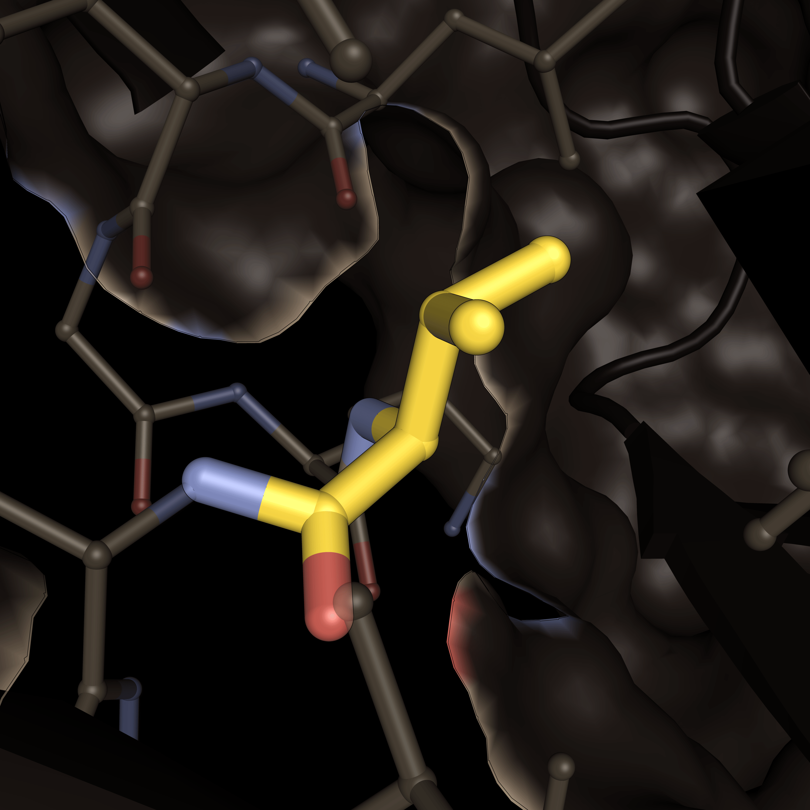
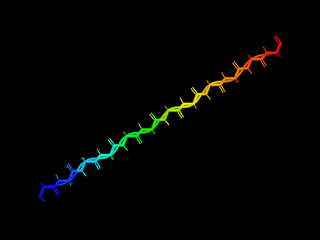
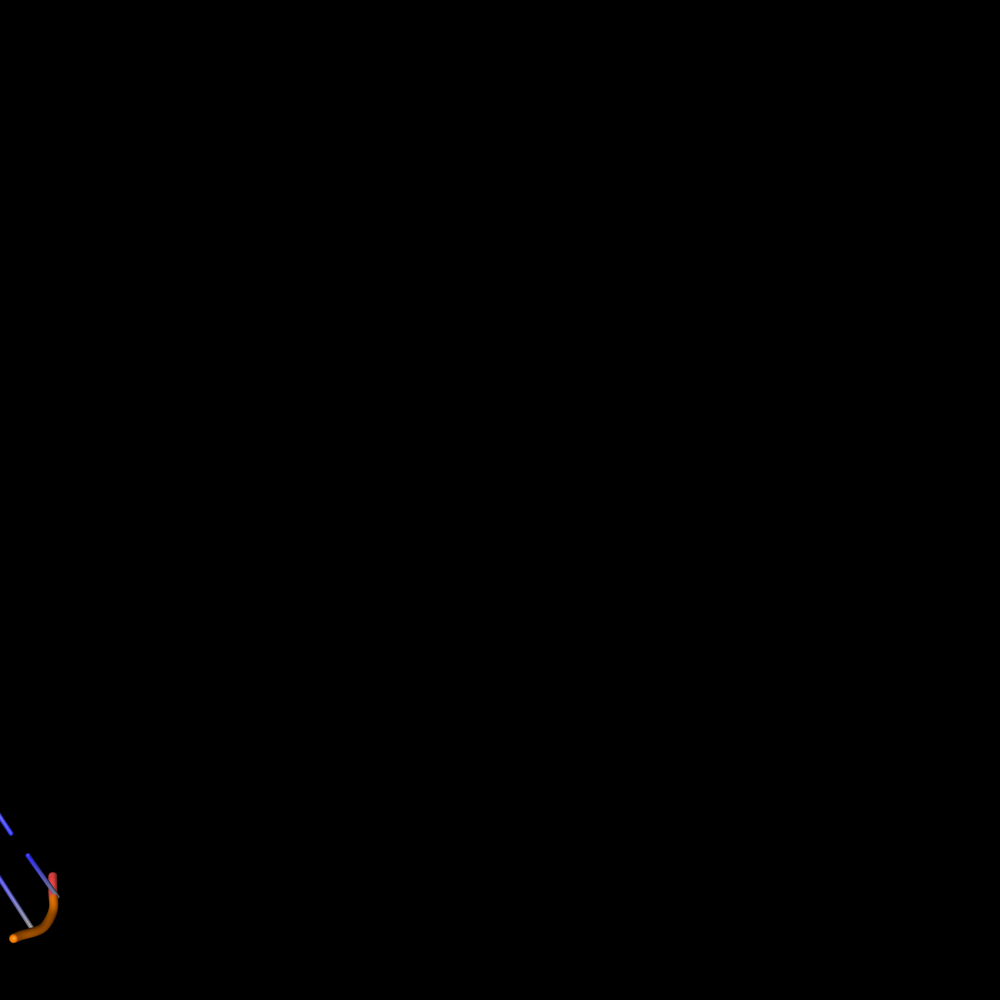
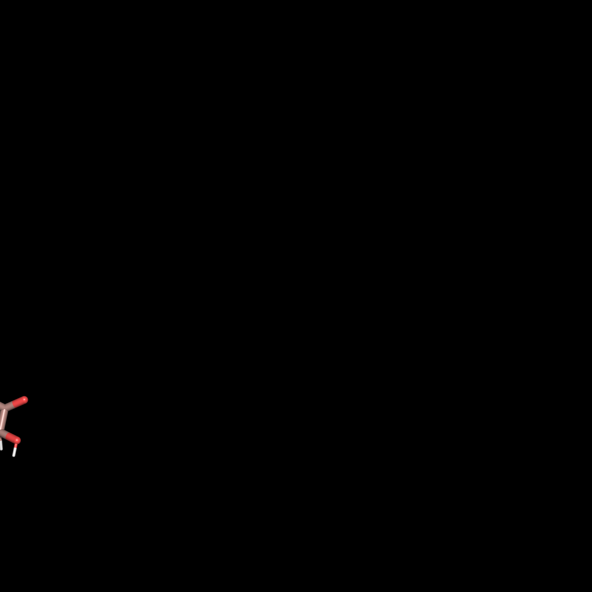
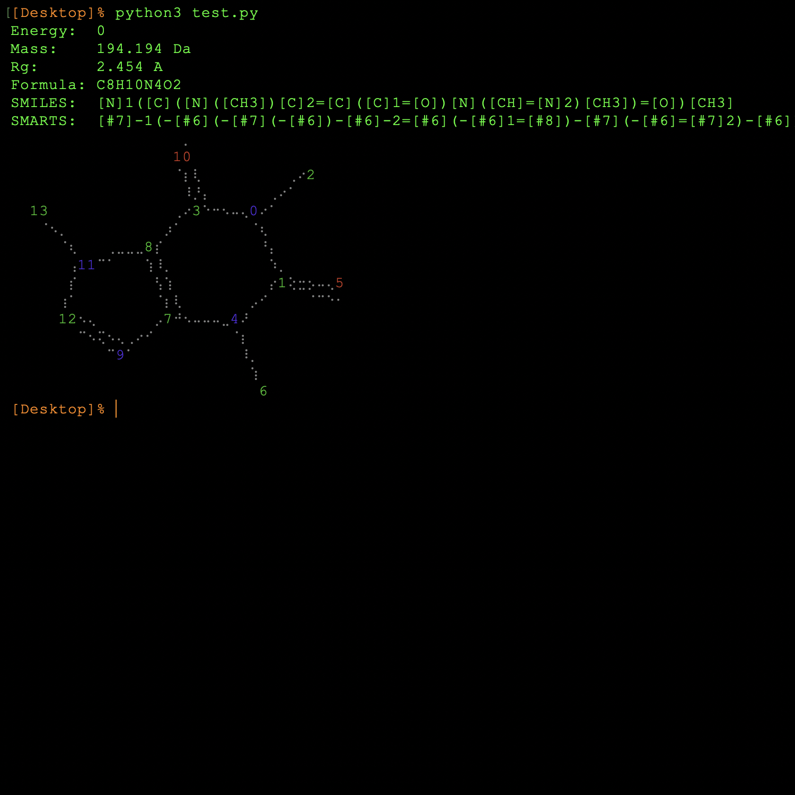

# Pose
A bare-metal Python library for building and manipulating the molecular structures of proteins, nucleic acids, and small organic molecules





---

## Video Tutorial

**Watch the full walkthrough:** [Video Tutorial on YouTube](https://www.youtube.com/@SariSabban)

---

## What is Pose?

Pose constructs a data structure for proteins, nucleic acids, or small organic molecules that contains all relevant information defining a polymer or an organic molecule. Primary information includes the XYZ cartesian coordinates of each atom, the identity and charge of each atom, and the bond graph of the entire molecule. Secondary information includes the FASTA sequence, radius of gyration, potential energy, and the secondary structure assignment for each protein residue.

Using this data structure, Pose can build and manipulate polypeptides, nucleic acids, or small organic molecules: construct any polypeptide or nucleic acid from sequence, move dihedral and rotamer angles, mutate residues and base pairs, and measure bond lengths and angles. It is designed as a substrate for higher-level protocols such as simulated annealing, molecular dynamics, and machine learning-based molecular design.

**Key features:**
- Designed to be extremely stable bare-metal python: NumPy is the only dependency for the core `Pose` and `Molecule` classes
- 26 amino acids supported by default (20 canonical + 6 non-canonical: ORN, MSE, TPO, SEC, FT6, PTR), and can be extended to 100+ amino acids
- Support for both L-amino acids and D-amino acids (mixed sequences fully supported)
- 5 DNA and RNA canonical nucleotides
- Full bond graph with atom partial charges
- Measure and rotate protein dihedral and rotamer angles (φ/ψ/ω/χ)
- Measure and rotate nucleic acids dihedral angles (α/β/γ/δ/ε/ζ/χ)
- Measure and adjust the distance and angle between any atoms
- PDB and mmCIF file import and export
- Pythonic zero-based indexing throughout (unlike PDB's one-based convention)
- Bundled bare-metal force field with analytic gradients, periodic-boundary support, and a hash-cached topology
- Bundled hybrid physics + statistical score function that is chirality-aware end to end across L-AA, D-AA, mixed L/D, and non-canonical residues
- Three production protocols: minimisation, simulated annealing, and molecular dynamics simulation

---

## Installation

**Dependencies:** Python >= 3, NumPy

For virtualenv:
```bash
pip install git+https://github.com/sarisabban/Pose
```

For anaconda:
```bash
conda create -n env python=3
conda activate env
pip3 install git+https://github.com/sarisabban/Pose
```

---

## Quick Start

```python
from pose import *

# === Build a peptide (no external files needed) ===
p = Pose()
p.Build('MSLESNRGI', chain='A', fmt='Protein')   # Uppercase=L-AA, lowercase=D-AA
p.GetInfo()                                      # Print structured summary

# === Inspect ===
print('Sequence:', p.data['FASTA'])
print('Mass:',     p.data['Mass'], 'Da')
print('Rg:',       p.data['Rg'], 'Å')

# === Manipulate backbone (zero-based indexing) ===
p.RotateDihedral(1, -60, 'PHI')
p.RotateDihedral(1, -45, 'PSI')
p.Mutate(2, 'V')                                 # Mutate residue index 2 (3 in PDB index) Leu → Val
p.Export('peptide.pdb')

# === Same code work for D-amino acids and mixed L/D sequences ===
p_d = Pose()
p_d.Build('MsLeSnRgI', chain='A', fmt='Protein') # Mixed L/D chirality-aware

# === Energy and protocols ===
ff = ForceField('OpenFF')                        # Small-molecule force field
# ff = ForceField()                              # 'Default' smoke-test FF (verification only)

E    = ff(p)                                     # Potential energy (kJ/mol)
E, F = ff(p, grad=True)                          # Also return per-atom forces

E_min, log  = Minimise(p, ff)                    # Relaxation
E_md,  log  = MolecularDynamics(p, ff, n_steps=1000, dt_fs=2.0, T=300.0, thermostat='langevin')
```

> Uppercase sequence letters build L-amino acids (natural form), lowercase builds D-amino acids (mirror images), and mixed sequences (e.g. `'MsLeSnRgI'` above) are fully supported.

**Importing a PDB file:**
```python
p = Pose()
p.Import('1TQG.pdb', chain='A')   # Or '1BNA.pdb' for a DNA/RNA structure
p.ReBuild()                       # Adds missing hydrogens
```

> Note: Importing a PDB structure with added Hydrogens will disrupt the *Bond Graph* in `p.data['Bonds']`, the bond graph in this situation won't include the hydrogens. It is recomended to run p.ReBuild() to re-establish the correct bond graph to include hydrogens (but this will change the positions of the Hydrogens). A trick to overcome this is to import the pose `p = Pose(); p.Import('1TQG.pdb')` and then seperatly import and rebuild the pose `p2 = Pose(); p2.Import('1TQG.pdb'); p2.ReBuild()` then substitute the bond graph from `p2` to `p`: `p.data['Bonds'] = p2.data['Bonds']`. This would solve it.

> Note: You can run `p.ReBuild()` after `Import()` to add hydrogens to the structure. But understand that a new synthetic structure will be built, therefore you will lose the original occupancy and temperature-factor for each atom (replaced with 1.0 and 0.0).

**Building DNA/RNA:**
```python
p = Pose()
p.Build('ATGCGTACGTTCCGGCAGACGT', chain='A', fmt='DNA')
p.GetInfo()
```

**Importing a small organic molecule:**
```python
m = Molecule()
m.Import('caffiene.sdf')
m.GetInfo()
```

**OpenMM plugin:**
```python
import io
import numpy as np
from sys import stdout
from pose import Pose
from openmm import *
from openmm.app import *
from openmm.unit import *

p = Pose()
p.Import('1YN3.pdb', chain='A')
#p.Build('GAILV')

pdbstr = p.Export(fmt='PDB')
#pdbstr = '\n'.join(l for l in pdbstr.split('\n') if not (l.startswith(('ATOM', 'HETATM')) and l[76:78].strip() == 'H')) # If building a structure using p.Build(), you need to remove all H so they can be added by openmm

pdb = PDBFile(io.StringIO(pdbstr)) # <-- the plugin
forcefield = ForceField('amber99sb.xml', 'tip3p.xml')
modeller = Modeller(pdb.topology, pdb.positions)
modeller.addHydrogens(forcefield)
modeller.addSolvent(forcefield, padding=1*nanometer)
pos = np.array(modeller.positions.value_in_unit(nanometer))
box = np.array(modeller.topology.getPeriodicBoxVectors().value_in_unit(nanometer))
shift = 0.5*(box[0]+box[1]+box[2]) - 0.5*(pos.min(axis=0)+pos.max(axis=0))
modeller.positions = [Vec3(*(p+shift)) for p in pos]*nanometer
system = forcefield.createSystem(modeller.topology, nonbondedMethod=PME, nonbondedCutoff=1*nanometer, constraints=HBonds)
integrator = LangevinIntegrator(300*kelvin, 1/picosecond, 0.002*picoseconds)
simulation = Simulation(modeller.topology, system, integrator)
simulation.context.setPositions(modeller.positions)
simulation.minimizeEnergy()
simulation.reporters.append(PDBReporter('output.pdb', 1000))
simulation.reporters.append(StateDataReporter(stdout, 1000, step=True, potentialEnergy=True, temperature=True))
simulation.step(10000)
```

> Note: `from openmm.app import *` rebinds `ForceField` to OpenMM's class. If you mix this snippet with the other Quick Start examples (which start with `from pose import *`), make sure the OpenMM star imports come *after* `from pose import *`, the last star import wins, and this example needs OpenMM's `ForceField('amber99sb.xml', ...)`. If you want both classes accessible in the same session, use explicit imports instead of `*` (e.g. `from openmm.app import ForceField as OpenMMForceField`).

**RDKit plugin:**
```python
from rdkit import Chem

CFF = 'CN1C=NC2=C1C(=O)N(C(=O)N2C)C'
m = Chem.MolFromSmiles(CFF)
# Manipulate a molecule using RDKit here
molstr = Chem.MolToMolBlock(m)

m = Molecule()
m.Import(molstr)
m.GetInfo()
```

This RDKit plugin gives you the power and flexibility to manipulate molecules using RDKit and then import them to the Molecule() class when they are ready.

---

## Key Concepts

### Zero-based indexing

All residue and atom indices start at 0, not 1. Residue 0 is the N-terminal amino acid. This is the **opposite** of PDB convention.

```python
p.Build('MSLESNRGI', chain='A', fmt='protein') # Construct a polypeptide
p.GetDihedral(0, 'PHI')                        # PHI of first residue (index 0)
p.GetDihedral(2, 'chi', 1)                     # CHI 1 of third residue (index 2)
p.GetDistance(0, 'N', 1, 'CA')                 # N of residue 1 (index 0) to CA of residue 2 (index 1)
p.Build('MSLESNRGI', chain='B', fmt='protein') # Add a second chain
```

### Accessing the data structure directly

```python
p.data['FASTA']              # Sequence string
p.data['Size']               # Number of residues (int)
p.data['Amino Acids'][0]     # [letter, chain, bb_indices, sc_indices, secondary structure, tricode, SASA]
p.data['Atoms'][0]           # [pdb_name, element, charge, occupancy, temp_factor, hybridisation]
p.data['Coordinates']        # Numpy array, shape (N, 3)
p.data['Bonds']              # Adjacency list: {atom_index: [bonded_atom_indices]}
```

Iterating over residues and atoms:
```python
for idx, aa in p.data['Amino Acids'].items():
    symbol, chain, bb, sc, ss, tricode, sasa = aa
    print(f'Residue {idx}: {tricode} ({symbol}), SS={ss}')

for idx, atom in p.data['Atoms'].items():
    name, element, charge, occupancy, temp, hybrid = atom
    xyz = p.data['Coordinates'][idx]
    print(f'Atom {idx}: {name} ({element}) at {xyz}')
```

### Supported Amino Acids

> Uppercase = L-form, lowercase = D-form. All 26 are supported in mixed L/D sequences. Additional amino acids can be added to the **database.json** file.

> The N-terminus is protonated, as expected at physiological pH (~7.4), and therefore exists as a positively charged ammonium group (–NH<sub>3</sub><sup>+</sup>)

|       |       |       |       |       |
|-------|-------|-------|-------|-------|
|A - ALA|B - ORN|C - CYS|D - ASP|E - GLU|
|F - PHE|G - GLY|H - HIS|I - ILE|J - MSE|
|K - LYS|L - LEU|M - MET|N - ASN|O - TPO|
|P - PRO|Q - GLN|R - ARG|S - SER|T - THR|
|U - SEC|V - VAL|W - TRP|X - FT6|Y - TYR|
|Z - PTR|

### Supported Nucleotides

#### DNA

|       |       |       |       |
|-------|-------|-------|-------|
|A - DA |T - DT |C - DC |G - DG |

#### RNA

|      |      |      |      |
|------|------|------|------|
|A - A |U - U |C - C |G - G |

---

## Method Reference

The following is a reference for all the Pose mothod functions.

### Call Class

| Class            | Description |
|------------------|-------------|
| `p = Pose()`     | Calls the `Pose()` class for proteins, DNA, or RNA |
| `m = Molecule()` | Calls the `Molecule()` class for small organic molecules |

Each class has similar methods and data structure, but with slight differences in the way they are used.

### Building & I/O

| Method                                                                   | Description |
|--------------------------------------------------------------------------|-------------|
| `p.Import(filename='1YN3.pdb', chain=['A', 'B'], model=1, strict=True)`  | Imports a structure from a PDB or mmCIF file and constructs the `p.data` object. Can import a protein, DNA, or RNA structure. `chain` accepts a single chain ID (`'A'`), a list of chains (`['A', 'B']`), or `None` to import all chains. `model` selects which model to import from multi-model files (e.g. NMR ensembles); defaults to `1`. For atoms with multiple conformers, the highest-occupancy conformer is kept. Cannot import a structure that is a mixture of proteins and nucleic acids in separate chains, import each macromolecule type as a separate pose. `strict=False` will allow importing broken chains |
| `m.Import(filename='caffiene.sdf')`                                      | Imports a structure from a PDB, SDF, mmCIF, MOL, or MOL2 files, or an RDKit block string and constructs the `m.data` object |
| `p.Export('out.pdb', fmt=None)`                                          | Write the full structure, and all chains, to a PDB or mmCIF file, file format is determined from the name string. On the other hand, `fmt='PDB'` or `fmt='CIF'` will export the structure as a string and not a file (ideal to plug the structure to other libraries such as OpenMM), thus default is `fmt=None` |
| `m.Export('out.sdf', fmt=None)`                                          | Write the full structure to a PDB, SDF, mmCIF, MOL, or MOL2 file, file format is determined from the name string. On the other hand, `fmt='PDB'` or `fmt='CIF'` or `'SDF'`/`'MOL'`/`'MOL2'` will export the structure as a string and not a file (ideal to plug the structure to other libraries such as OpenMM and RDKit), thus default is `fmt=None` |
| `p.Build('MSLESNRGI', chain='A', fmt='protein')`                         | Build a macromolecule from a one-letter sequence. For a polypeptide add the sequence and choose the format `fmt='Protein'`, uppercase for L-amino acids, lowercase for D-amino acids. For nucleic acid add the sequence and choose the format `fmt='DNA'` or `fmt='RNA'`. You can add more chains by repeating the command with different chain `chain='A'` values. A structure can either be a protein, or a nucleic acid (DNA/RNA), it cannot be a mixture of the two |
| `p.ReBuild(sequence=None, mirror=False, _mutated=None)`                  | Rebuild the polypeptide or nucleic acid. Use `sequence='AGLMTSWVLVA'` to rebuild the structure with multiple bulk mutations on chain A. Use `sequence={'A':'MSLKLSTVVA', 'B':'ASLKSWFWVA'}` to perform mutations at multiple chains at the same time. Use `mirror=True` to rebuild a protein and convert L-amino acids to D-amino acids or D-amino acids to L-amino acids. This also works on a structure with a mixture of the two orientations by mirroring the entire structure. Running `p.ReBuild(sequence=None)` will add missing Hydrogens. For DNA and RNA, the `sequence=''` length must match exactly the original sequence length, otherwise an error will be raised |
| `p.Mutate(1, 'V', fast=True)`                                            | Mutate a single monomer. For proteins: `p.Mutate(1, 'V')` will mutate residue 1 to L-Valine, `p.Mutate(1, 'v')` will mutate residue 1 to D-Valine. For DNA: `p.Mutate(0, 'T')` will mutate nucleotide 0 to Thymine. For RNA: `p.Mutate(0, 'U')` will mutate nucleotide 0 to Uracil. For double-stranded nucleic acids, the complementary base is also updated automatically. The `fast=True` argument means the mutation is performed by vector addition without ensuring the stability of the backbone, also the `p.CalcSASA()` is not re-computed, so it needs to be called manually after the mutation, in return the mutation is very fast, ideal for large mutation simulations. If `fast=False` the mutated residue is added to the structure and the entire structure rebuilt using ReBuild(), this is more accurate but very slow for large simulations everything is re-computed) |

### Measurements

| Method                                       | Description |
|----------------------------------------------|-------------|
| `p.GetDistance(0, 'N', 5, 'CA')`             | Get the distance in Å between any two atoms. Example: residue 0 N atom to residue 5 CA atom |
| `m.GetDistance(0, 5)`                        | Get the distance in Å between any two atoms. Example: atom 0 to atom 5 |
| `p.GetDihedral(2, 'PHI')`                    | Calculate the amino acid's φ/ψ/ω/χ or the nucleotide's α/β/γ/δ/ε/ζ/χ dihedral angles. For example, the PHI angle of the 3<sup>rd</sup> protein residue (index 2). For protein χ dihedral use `p.GetDihedral(4, 'chi', 1)` 5<sup>th</sup> residue (index 4), CHI 1 angle |
| `m.GetDihedral(0, 1, 2, 3)`                  | Calculate a dihedral angle between 4 atoms. In this example the dihedral angle is made up of the atoms at indeces 0, 1, 2, and 3 |
| `p.GetAngle(0, 'N', 5, 'CA', 17, 'C')`       | Get the angle between any three atoms in the whole structure. Example: N of residue 1, CA of residue 5, and C angle of residue 17, with the CA atom in the middle being the pivot |
| `m.GetAngle(0, 5, 17)`                       | Get the angle between any three atoms in the whole structure. Example: atom at index 1, atom at index 5, and atom at index 17, with atom at index 5 being the pivot |
| `p.GetAtomBonds(0, 1)`                       | Confirm that two atoms are bonded and get their PDB and element names `[atom 1 element name, atom 1 PDB name, atom 2 element name, atom 2 PDB name]`. If the two atoms are not bonded an error will be raised |
| `m.GetAtomBonds(1)`                          | Get all atom names bonded to this atom index ['atom name 1', 'atom name 2', 'atom name 3'] |
| `p.GetAtomCoord(3, 'N')`                     | Get the XYZ coordinates of an atom of a residue or a nucleotide (monomers). Example: `N` nitrogen of monomer index `3` |
| `m.GetAtomCoord(3)`                          | Get the XYZ coordinates of an atom given its index. Example: atom at index `3` |
| `p.GetAtomList(PDB=False)`                   | Get a list of all atom element names for the entire structure. Use `PDB=True` for PDB-formatted names |
| `m.GetAtomList()`                            | Get a list of all atom element names for the entire structure |
| `p.GetAtomHybridisation()`                   | Get a list of all atom hybridisations for the entire structure |
| `m.GetAtomHybridisation()`                   | Get a list of all atom hybridisations for the entire structure |
| `p.GetAtomIdx(3, 'N')`                       | Get the atom index in `p.data['Coordinates']` from its name within a monomer. This is the opposite of `p.GetAtomCoord(3, 'N')` |
| `p.GetIdentity(0, 'Atom')`                   | Identify the PDB name of an atom, or an amino acid, or a nucleotide by its index. Example `p.GetIdentity(5, 'Atom')` or `p.GetIdentity(5, 'amino acid')` or `p.GetIdentity(5, 'nucleotide')`. Also, specifically just for atoms, you can return its partial charge using `p.GetIdentity(3, 'Atom', charge=True)` |
| `p.GetInfo()`                                | Print a formatted summary of the structure's information |
| `m.GetInfo()`                                | Print a formatted summary of the structure's information and a graphical representation of the molecule |
| `m.CalcSMILES()`                             | Calculate the SMILES representation of a molecule and add it to `m.data['SMILES']` |
| `m.CalcSMARTS()`                             | Calculate the SMARTS representation of a molecule and add it to `m.data['SMARTS']` |
| `m.CalcSMIRKS()`                             | Calculate the SMIRKS representation of a molecule and add it to `m.data['SMIRKS']` |
| `p.CalcMass()`                               | Calculates the entire molecular mass of a molecule (all chains) in Da (Daltons), updates the value of p.data['Mass'] |
| `m.CalcMass()`                               | Calculates the entire molecular mass of a molecule, updates the value of m.data['Mass'] |
| `p.CalcSize()`                               | Calculates the length of each chain in a structure, updates the value of p.data['Size']. You can get the length of each chain using `p.data['Size'][CHAIN]` |
| `p.CalcFASTA()`                              | Compiles the FASTA sequence of each chain, updates the value of p.data['FASTA']. You can get the FASTA sequence of each chain using `p.data['FASTA'][CHAIN]` |
| `p.CalcRg()`                                 | Calculates the entire Radius of Gyration of a molecule (all chains) in Å (angstrom), updates the value of p.data['Rg'] |
| `m.CalcRg()`                                 | Calculates the entire Radius of Gyration of a molecule, updates the value of p.data['Rg'] |
| `p.CalcCharge(iterations=6)`                 | Calculate the Gasteiger-Marsili partial charges to all atoms using iterative equalization (default 6 iterations), updates the value of `p.data['Atoms'][index][2]` |
| `m.CalcCharge(iterations=6)`                 | Calculate the Gasteiger-Marsili partial charges to all atoms using iterative equalization (default 6 iterations), updates the value of `m.data['Atoms'][index][2]` |
| `p.CalcDSSP()`                               | Calculates each amino acid's secondary structure assignments, only for proteins, and stores them in `p.data['Amino Acids'][i][4]` and updates `p.data['SS']`, therefore this is where you can get the secondary structure sequence of each chain. Codes: H=α-helix, G=3₁₀-helix, I=π-helix, E=β-sheet, B=β-bridge, T=turn, S=bend, L=loop, P=PPII-helix |
| `p.CalcSASA(n_points=960, probe_radius=1.4)` | Calculates the Solvent Accessible Surface Area (SASA) for each amino acid, only for proteins, using golden sphere sampling. `n_points` controls sampling density, `probe_radius` is the solvent probe radius in Å (default 1.4 for water). Adds the value to `p.data['Amino Acids'][i][6]` |

### Manipulation

| Method                                                   | Description |
|----------------------------------------------------------|-------------|
| `p.AdjustDistance(0, 'N', 4, 'C', 17)`                   | Set the distance between any two atoms in (Å). Example: set the distance between N in residue 0 and C in residue 4 to 17 Å. Order matters: the second atom (and all atoms downstream of it on the same chain) moves, while the first atom stays fixed. `(0, 'N', 0, 'CA', d)` ≠ `(0, 'CA', 0, 'N', d)` |
| `m.AdjustDistance(0, 4, 17)`                             | Set the distance between any two atoms in (Å). Example: set the distance between atom at index 0 and atom at index 4 to 17 Å. Order matters: the second atom (and all atoms downstream of it) moves, while the first atom stays fixed. `(0, 1, d)` ≠ `(1, 0, d)` |
| `p.AdjustAngle(1, 'N', 1, 'CA', 1, 'C', -2)`             | Add/subtract degrees from a three-atom angle, with the middle atom being the pivot point. Example: subtract 2° from N–CA–C angle of residue 1, with the CA atom being the pivot |
| `m.AdjustAngle(0, 1, 2, -2)`                             | Add/subtract degrees from a three-atom angle, with the middle atom being the pivot point. Example: subtract 2° from the angle represented by atom 0, atom 1, and atom 2, with atom 1 being the pivot |
| `p.RotateDihedral(1, -60, 'PHI')`                        | Rotate the amino acid's φ/ψ/ω/χ or the nucleotide's α/β/γ/δ/ε/ζ/χ dihedral angles. Example: rotate residue 1's PHI dihedral to -60° |
| `m.RotateDihedral(0, 1, 2, 3, -60)`                      | Rotate any dihedral angle represented by four atoms. Example: rotate a dihedral angle represented by atom index 0, atom index 1, atom index 2, and atoms index 3 to become -60° |
| `p.MovePose(theta=5, u=[18, 10, 5], l=6, ori=[0, 0, 0])` | Rotate and/or translate the whole structure. `theta` is the rotation angle in degrees, `u` is the rotation axis vector (will be normalised), `l` is the translation distance in Å, `ori` is the target point to translate towards. All parameters are optional (default `None`), you can rotate only, translate only, or both |
| `m.MovePose(theta=5, u=[18, 10, 5], l=6, ori=[0, 0, 0])` | Rotate and/or translate the whole structure. `theta` is the rotation angle in degrees, `u` is the rotation axis vector (will be normalised), `l` is the translation distance in Å, `ori` is the target point to translate towards. All parameters are optional (default `None`), you can rotate only, translate only, or both |

### Force Field methods

The `ForceField()` class evaluates the total potential energy and analytical per-atom forces of a `Pose` or `Molecule`. It is configured by **name** at construction, the name keys into `database.json['Energy Parameters'][NAME]`, which carries both the SMIRKS-keyed parameter sections and the explicit list of potential methods to evaluate (under the `Terms` sub-key). The currently shipped names are:

| Name      | Purpose |
|-----------|---------|
| `Default` | Deterministic smoke-test for development purposes with dummy parameters, tuned so that `ForceField()(Pose().Build('AaBbCcDdEeFfGgHhIiJjKkLlMmNnOoPpQqRrSsTtUuVvWwXxYyZz')) = 100.00 kJ/mol` exactly. It exercises **every** potential method |
| `OpenFF`  | Small-molecule force field. Bonded + vdW parameters from [OpenFF Sage 2.3.0](https://github.com/openforcefield/openff-forcefields) ([CC-BY-4.0](https://creativecommons.org/licenses/by/4.0/)); per-atom AM1BCC charges from a NumPy reimplementation of [NAGL](https://github.com/openforcefield/openff-nagl-models) |

A hash of the bond graph + atom records + amino-acid assignments is cached, so repeated calls during minimisation, MD, or annealing only recompute coordinate-dependent quantities.

| Method                                                                          | Description |
|---------------------------------------------------------------------------------|-------------|
| `ff = ForceField(name='Default', strict=False)`                                 | Build a force field. `name` is any key in `database.json['Energy Parameters']`, case-insensitive: `Default` and `OpenFF` ship, `Port()` adds `ff19SB` and `CHARMM36`. `strict=True` raises `RuntimeError` on a SMIRKS coverage gap, `strict=False` leaves the gap at zero |
| `E = ff(pose, grad=False, box=None, v=False)`                                   | Total potential energy in kJ/mol. `grad=False` returns a float, `grad=True` returns `(E, F)` with forces `(N, 3)` in kJ/mol/Å. `box=None` disables PBC, a `(3,)` array is an orthorhombic box, a `(3, 3)` array is triclinic, both in Å. `v=True` prints SMIRKS patterns that matched nothing |
| `E, F = ff(pose, grad=True, box=None)`                                          | Same call with `grad=True`, returning energy plus analytic per-atom forces |
| `ff.BondPotential(pose, cache, alg='harmonic', grad=True, box=None)`            | Bond stretching. `alg='harmonic'` is `Σ K_b·(r − r₀)²`, `alg='morse'` is `Σ D_e·(1 − e^(−a(r − r₀)))²` |
| `ff.AnglePotential(pose, cache, grad=True, box=None)`                           | Harmonic three-atom angle bending over every bonded triplet, `Σ K_θ·(θ − θ₀)²` |
| `ff.UBPotential(pose, cache, grad=True, box=None)`                              | Urey-Bradley 1-3 stretching between the outer atoms of every bonded triplet, `Σ K_UB·(s − s₀)²` |
| `ff.ProperTorsionPotential(pose, cache, grad=True, box=None)`                   | Proper dihedral over every i-j-k-l quartet, multi-component Fourier `Σ K_φ·(1 + cos(n·φ − φ₀))` |
| `ff.ImproperTorsionPotential(pose, cache, alg='harmonic', grad=True, box=None)` | Improper dihedral over degree-3 atoms. `alg='harmonic'` is `Σ K_φ·(ψ − ψ₀)²`, `alg='fourier'` is `Σ K_φ·(1 + cos(n·ψ − ψ₀))` |
| `ff.VDWPotential(pose, cache, alg='12-6', grad=True, box=None)`                 | Van der Waals non-bonded term with 1-4 scaling. `alg='12-6'` is `Σ 4ε·[(σ/r)¹² − (σ/r)⁶]`, `alg='9-6'` is the softer `Σ ε·[2(σ/r)⁹ − 3(σ/r)⁶]` |
| `ff.ElectrostaticPotential(pose, cache, alg='constant', grad=True, box=None)`   | Coulomb non-bonded term with 1-4 scaling. `alg='constant'` is `Σ 1389.35·qᵢqⱼ / (εᵣ·r)`, `alg='ddd'` uses a distance-dependent dielectric, `Σ 1389.35·qᵢqⱼ / (εᵣ·r²)` |
| `ff.PolarisationPotential(pose, cache, alg='constant', grad=True, box=None)`    | Induced-dipole polarisation, `−½·Σ αᵢ·|Eᵢ|²`, zero when the force field sets α = 0. The per-atom field falls as `1/r³` under `alg='constant'` and `1/r⁴` under `alg='ddd'` |
| `ff.CMAPPotential(pose, cache, alg='catmullrom', grad=True, box=None)`          | Backbone (φ, ψ) cross-term correction on the per-residue 24×24 grid. `alg='catmullrom'` is centred-difference bicubic, `alg='openmm'` is periodic-cubic-spline bicubic |

> **Charge model**: under `OpenFF`, partial charges are computed by `ForceField.NAGLCharges(pose)`, a NumPy reimplementation of the [`openff-gnn-am1bcc-1.0.0`](https://github.com/openforcefield/openff-nagl-models) graph neural network released by the [Open Force Field Initiative](https://github.com/openforcefield). Output is bit-equivalent to upstream NAGL float32 inference, with the total constrained to the molecule's formal charge via electronegativity equalisation. NAGL weights live under `['OpenFF']['AM1BCC']`; force fields without that sub-key (e.g. `Default`) skip NAGL and fall back to library charges then atom-record charges. SMIRKS pattern assignment for bonded and vdW parameters is done in `pose.energy.SMIRKSMatch(pose, params)`, a pure-NumPy SMIRKS engine. All numerical values in `database.json` are in **kJ/mol** (lengths in Å, angles in degrees).

### Energy score methods

The `Score()` class evaluates an empirical scoring function on a `Pose`, or a small-molecule `Molecule` ligand. Like `ForceField()` it is configured by **name** at construction, the name keys into `database.json['Score Parameters'][NAME]`, which carries both the parameter blocks and the explicit list of term methods to evaluate (under the `Terms` sub-key). It returns a value in the respective source units, REU for `ref15`, kcal/mol for `Autodock vina`, and dimensionless for `Default`.

| Method                                                       | Description |
|--------------------------------------------------------------|-------------|
| `sf = Score(name='Default', strict=False)`                   | Build a scoring function. `name` is any key in `database.json['Score Parameters']`, case-insensitive: `Default` ships, `Port()` adds `REF15` and `AutoDock Vina`. `strict` is accepted but currently unread |
| `S = sf(pose, ligand=None)`                                  | Total score in the set's native unit — REU for `REF15`, kcal/mol for `AutoDock Vina`, dimensionless for `Default`. `ligand=None` scores the pose alone; a `Molecule` adds receptor-ligand and intra-ligand pairs, which `REF15` ignores |
| `S, per_term = sf(pose, ligand=None, decompose=True)`        | `decompose=False` returns the total alone, `decompose=True` also returns a per-method dict of `inter_raw`, `intra_raw`, `inter_weighted`, `intra_weighted` and `raw`, plus a `_summary` entry |
| `S = sf(pose, ligand, xs_override=None, nrot_override=None)` | Validation hooks, both `None` in normal use. `xs_override` maps a combined receptor+ligand atom index to an XS type name, bypassing derived typing; `nrot_override` forces the ligand rotatable-bond count |
| `sf.Gauss1Potential(pose, cache, ligand=None)`               | Steric Gaussian at surface contact, `exp(−(d/0.5)²)` with `d = r − (Rᵢ + Rⱼ)`. Zero unless `ligand` is a `Molecule` |
| `sf.Gauss2Potential(pose, cache, ligand=None)`               | Broader steric Gaussian centred at 3 Å, `exp(−((d − 3)/2)²)`. Zero unless `ligand` is a `Molecule` |
| `sf.RepulsionPotential(pose, cache, ligand=None)`            | Steric overlap penalty, `d²` for `d < 0` and zero otherwise. Zero unless `ligand` is a `Molecule` |
| `sf.HydrophobicPotential(pose, cache, ligand=None)`          | Hydrophobic contact, a linear ramp from 1 at `d ≤ good` to 0 at `d ≥ bad`. Zero unless `ligand` is a `Molecule` |
| `sf.HBondPotential(pose, cache, ligand=None)`                | Donor-acceptor contact, the same linear ramp with no angular term. Zero unless `ligand` is a `Molecule` |
| `sf.TorsionalPenalty(pose, cache, ligand=None)`              | Marker only, contributing nothing and producing no `per_term` entry. Its presence makes `__call__` divide the intermolecular sum by `1 + 0.05846·N_rot` and drop the intramolecular sum |
| `sf.FaAtrPotential(pose, cache, ligand=None)`                | Attractive half of the inter-residue 12-6 Lennard-Jones split at the minimum, `−ε` inside `r_min` and `E_LJ` outside, faded cubically to zero between 4.5 and 6 Å |
| `sf.FaRepPotential(pose, cache, ligand=None)`                | Repulsive half of the same split, `E_LJ + ε` inside `r_min` and zero outside, ramped linearly below 0.6·σ |
| `sf.FaSolPotential(pose, cache, ligand=None)`                | Inter-residue Lazaridis-Karplus solvation, `−ΔGᵢ·Vⱼ·e^(−x²) / (2π^{3/2}·λᵢ·r²)` with `x = (r − Rᵢ)/λᵢ` |
| `sf.FaIntraRepPotential(pose, cache, ligand=None)`           | The repulsive split restricted to intra-residue pairs, count-pair crossover 3: pairs ≤2 bonds apart are dropped, 3-bond pairs take `CountPair.half`, ≥4 take full weight |
| `sf.FaIntraSolXover4Potential(pose, cache, ligand=None)`     | The LK solvation restricted to intra-residue pairs, count-pair crossover 4: pairs ≤3 bonds apart are dropped, 4-bond pairs take `CountPair.half`, ≥5 take full weight |
| `sf.FaElecPotential(pose, cache, ligand=None)`               | Coulomb term under a sigmoidal distance-dependent dielectric, `C₀·qᵢqⱼ / (ε(r)·r)`, clamped below 1.6 Å and shifted to zero at 5.5 Å |
| `sf.LkBallWtdPotential(pose, cache, ligand=None)`            | Anisotropic LK solvation: virtual water sites are placed around each polar atom and the isotropic desolvation is reweighted by how far occluding atoms overlap them |
| `sf.HBondSrBbPotential(pose, cache, ligand=None)`            | Short-range backbone-backbone hydrogen bonds, `hbw_SR_BB`. All four hbond terms share one geometry pass over the A-H distance and the `cosBAH`/`cosAHD` angular polynomials |
| `sf.HBondLrBbPotential(pose, cache, ligand=None)`            | Long-range backbone-backbone hydrogen bonds, `hbw_LR_BB` |
| `sf.HBondBbScPotential(pose, cache, ligand=None)`            | Backbone-sidechain hydrogen bonds, `hbw_SR_BB_SC` and `hbw_LR_BB_SC` |
| `sf.HBondScPotential(pose, cache, ligand=None)`              | Sidechain-sidechain hydrogen bonds, `hbw_SC` |
| `sf.FaDunPotential(pose, cache, ligand=None)`                | Backbone-dependent rotamer probability, `−ln P(rot\|φ,ψ) + ½·Σ((χ − μ)/σ)²`, interpolated over the φ/ψ grid |
| `sf.RamaPreProTermPotential(pose, cache, ligand=None)`       | Ramachandran backbone propensity, `−ln P(φ,ψ)`, using the separate pre-proline map for residues that precede a proline |
| `sf.PAaPpPotential(pose, cache, ligand=None)`                | Amino-acid identity propensity given the backbone torsions, `−ln P(aa\|φ,ψ)` |
| `sf.OmegaPotential(pose, cache, ligand=None)`                | Harmonic tether on the peptide-bond ω torsion, `K_ω·(ω − ω₀)²`. The μ/σ table is chosen by the residue's own identity — `gly`, `pro`, `valile` for Ile/Val, otherwise `all` |
| `sf.ProClosePotential(pose, cache, ligand=None)`             | Proline ring-closure restraint on the virtual `NV` atom, plus the ring planarity terms |
| `sf.DslfFa13Potential(pose, cache, ligand=None)`             | Disulfide geometry over the S-S distance, the Cβ-Sγ-Sγ′-Cβ′ dihedrals and the Cα-Cβ-Sγ angles |
| `sf.YhhPlanarityPotential(pose, cache, ligand=None)`         | Tyrosine hydroxyl planarity, `½·(cos(π − 2·χ₃) + 1)` |
| `sf.RefPotential(pose, cache, ligand=None)`                  | Per-amino-acid unfolded-state reference energy, `Σ ref[aa]`, a constant offset per residue identity |

**Score is chirality-aware**: L-amino acids, D-amino acids, mixed L/D sequences, and non-canonical residues all score correctly with no extra arguments or special-cased call sites.


### Other Tools


## Data Structure Reference

Get the content of the structure's JSON object using `print(p.data[KEY])`

This `p.data` structure from the `Pose()` class represents proteins, DNA, and RNA:

| Key           | Value Type  | Description |
|---------------|-------------|-------------|
| `Type`        | String      | Identifies the structure as a protein, DNA, or RNA |
| `Energy`      | Float       | Potential energy or score of the molecule |
| `Rg`          | Float       | Radius of gyration |
| `Mass`        | Float       | Mass in Daltons |
| `Size`        | Dict        | Length of each chain, ie: the number of monomers in each chain |
| `FASTA`       | Dict        | One-letter sequence for each chain |
| `SS`          | Dict        | One-letter amino acid secondary structure asignments for each chain |
| `Nucleotides` | Dict        | `{index: [symbol, chain, bb_atom_indices, sc_atom_indices, tricode]}`, **zero-based indexing** |
| `Amino Acids` | Dict        | `{index: [symbol, chain, bb_atom_indices, sc_atom_indices, secondary_struct, tricode, SASA]}`, **zero-based indexing** |
| `Atoms`       | Dict        | `{atom_index: [pdb_name, element, partial charge, occupancy, temp_factor, hybridisation]}`, **zero-based indexing** |
| `Bonds`       | Dict        | Bond graph as adjacency list: `{atom_index: [bonded_atom_indices]}`, **zero-based indexing** |
| `BondOrders`  | Dict        | Bond order as an adjacency list, 1 = single bonds, 1.5 = delocalised bond, such as aromatic rings, resonance systems, or partial-double bond, 2 = double bonds, 3 = triple bonds |
| `Coordinates` | NumPy array | Shape `(N, 3)`, Cartesian XYZ for each atom |

This `m.data` structure from the `Molecule()` class represents small organic molecules:

| Key           | Value Type  | Description |
|---------------|-------------|-------------|
| `Type`        | String      | Identifies the structure as a molecule |
| `Energy`      | Float       | Potential energy of the molecule |
| `Rg`          | Float       | Radius of gyration |
| `Mass`        | Float       | Molecule's molecular mass |
| `SMILES`      | Str         | The SMILES representation of the molecule as a string |
| `SMARTS`      | Str         | The SMARTS representation of the molecile as a string |
| `SMIRKS`      | Str         | The SMIRKS representation of the molecile as a string |
| 'Formula'     | Str         | The molecular formula of the molecule |
| `Atoms`       | Dict        | `{atom_index: [pdb_name, element, partial charge, hybridisation]}`, **zero-based indexing** |
| `Bonds`       | Dict        | Bond graph as adjacency list: `{atom_index: [bonded_atom_indices]}`, **zero-based indexing** |
| `BondOrders`  | Dict        | Bond order as an adjacency list, 1 = single bonds, 1.5 = aromatic resonance partial-double bond, 2 = double bonds, 3 = triple bonds |
| `Coordinates` | NumPy array | Shape `(N, 3)`, Cartesian XYZ for each atom |

> The `hybridisation` field is one of `'s'` (hydrogens), `'sp'`, `'sp2'`, or `'sp3'`.

> Each atom's hybridisation is stored as the last element of its atom record: `p.data['Atoms'][i][5]` for `Pose()`, `m.data['Atoms'][i][3]` for `Molecule()`.

---

## database.json overview

Pose ships a single `database.json` file (~70 MB) under `pose/` with **five** top-level keys:

| Top-level key      | Purpose |
|--------------------|---------|
| `Amino Acids`      | Per-residue topology templates for amino acids: backbone & sidechain atoms, vectors, bonds, χ angle atoms |
| `Nucleotides`      | Per-nucleotide topology templates for DNA and RNA |
| `Rotamer Library`  | Backbone-dependent rotamer mixture data (Dunbrack BBDEP2010 derived), or Rosetta (MakeRotLib) generated for NCAAs |
| `Energy Parameters`| Named force-field parameter sets, keyed by force-field name. Two ship today `openFF` (Sage 2.3.0 small-molecule FF, CC-BY-4.0) and `Default` (deterministic smoke-test calibrated to 100.00 kJ/mol anchor) |
| `Score Parameters` | Named score parameter sets, keyed by score function name. One ships today `Default` (deterministic smoke-test calibrated to 100.00 anchor) |

The whole file is loaded once per Python process via the cached module-level loader `pose.DBLoad()`, thus if you want to investogate the database use this code `p = Pose(); DB = DBLoad()`

### Description of amino acids in database.json:

This information resides in `database['Amino Acids'][AMINO_ACID_UNICODE or BACKBONE]`

| Dictionary Key                        | Value Type     | Description of Values |
|---------------------------------------|----------------|-----------------------|
| `Vectors`                             | List of lists  | The position of each atom relative to the first backbone atom (N for amino acids, P for nucleotides). If the N coorinate is X, Y, Z = 0, 0, 0 you will get these stored vectors |
| `Tricode`                             | String         | The three letter code for each amino acid, `[0]` for the L-AA tricode `[1]` for the D-AA tricode |
| `Fused`                               | Boolian        | True = the sidechain is fused to the backbone, such as in Proline |
| `Backbone Atoms` or `Sidechain Atoms` | List of lists  | The atom identity of each coordinate point, for example: first coordinate point is the nitrogen with symbol N and PDB entry N, next atom is the hydrogen that is bonded to the nitrogen with symbol H and PDB entry 1H etc... Unlike the PDB where all hydrogens are collected after the heavy atoms, here each atom's hydrogens come right after it. This makes for easier matrix operations. Order is `[PDB atom's name, element, partial charge, occupancy, temperature factor, hybridisation]` |
| `Chi Angle Atoms`                     | List of lists  | The atoms in the sidechain that are contributing to a chi angle |
| `Bonds`                               | Dictionary     | The bond graph as an adjacency list |
| `BondOrders`                          | Dictionary     | The bond order graph as an adjacency list, 1 = single bonds, 1.5 = aromatic resonance partial-double bond, 2 = double bonds, 3 = triple bonds |

### Description of nucleotides in database.json:

This information resides in `database['Nucleotides'][NUCEOTIDE_TRICODE]`

| Dictionary Key    | Value Type     | Description of Values |
|-------------------|----------------|-----------------------|
| `Vectors`         | List of lists  | The position of each atom relative to the N of the backbone. If the N coorinate is X, Y, Z = 0, 0, 0 you will get these stored vectors |
| `Tricode`         | String         | The three letter code for each nucleotide |
| `Type`            | String         | Identify as `DNA` or `RNA` |
| `Backbone Atoms`  | List of lists  | The atom identity of each backbone coordinate point, first coordinate point is the phosphorus with symbol P and PDB entry P, next atom is the oxygen atom that is bonded to the phosphorus with symbol O and PDB entry OP1 etc... Order is `[PDB atom's name, element, partial charge, occupancy, temperature factor, hybridisation]` |
| `Base Atoms`      | List of lists  | The atom identity of each nitrogen base coordinate point. Order is `[PDB atom's name, element, partial charge, occupancy, temperature factor, hybridisation]` |
| `Chi Angle Atoms` | List of lists  | The atoms in the sidechain that are contributing to a chi angle |
| `Bonds`           | Dictionary     | The bond graph as an adjacency list |
| `BondOrders`      | Dictionary     | The bond order graph as an adjacency list, 1 = single bonds, 1.5 = aromatic resonance partial-double bond, 2 = double bonds, 3 = triple bonds |

### Description of the Rotamer Library in database.json:

This information resides in `database['Rotamer Library']`. Derived from the Dunbrack BBDEP2010 rotamer library (Shapovalov & Dunbrack 2011, CC-BY-4.0). Rotamers of NCAAs were derived using Rosetta's *MakeRotLib*.

**Top-level shape:**

| Key             | Value Type     | Description |
|-----------------|----------------|-------------|
| `format`        | String         | Format identifier (currently `"rot_v1"`) |
| `version`       | Int            | Schema version |
| `phi_start`     | Float          | φ lower edge in degrees, default `-180` |
| `phi_step`      | Float          | φ width in degrees, default `10` |
| `phi_n`         | Int            | Number of φ bins, default `36` |
| `psi_start`     | Float          | ψ lower edge in degrees, default `-180` |
| `psi_step`      | Float          | ψ width in degrees, default `10` |
| `psi_n`         | Int            | Number of ψ bins, default `36` |
| `density_grids` | List           | Per-residue total-density grids |
| `residues`      | Dict           | Per-residue rotamer mixture data, keyed by residue tricode |

**Per-residue entry, `database['Rotamer Library']['residues'][TRICODE]`:**

| Key        | Value Type | Description |
|------------|------------|-------------|
| `n_chi`    | Int        | Number of χ angles for this residue type |
| `rotamers` | Dict       | The rotamer data |
| `densities`| List/None  | Per-cell density auxiliary, usually `null` |

**Per-residue `database['Rotamer Library']['residues'][TRICODE]['rotamers']`:**

| Key            | Value Type     | Description |
|----------------|----------------|-------------|
| `table`        | List of rows   | Flat list of all rotamer rows across every (φ, ψ) cell. `[index, per-cell normalised probability, per-rotamer mean χ1...χn values in degrees, 𝜎1...𝜎n standard deviations in degrees]` |
| `bin_offsets`  | List of ints   | CSR indexing of each bin in `table`, length `phi_n × psi_n + 1 = 1297`. Basically it tells you a rotamer bin is from which index to which index in `table` |

**Lookup pattern (used internally by `Rotamers`, `Pack`, and `Score._rotamer_prior`):**

D-amino acid handling: the library is keyed on the L-form 3-letter code only. Consumers fetch the L cell at `(−φ, −ψ)` and negate the recovered μ values when applying them, exploiting the chi/Ramachandran mirror symmetry between enantiomers.

### Description of energy parameters in database.json:

`database['Energy Parameters'][NAME]` is a dict of **named force-field parameter sets**. Two ship today: `openFF` (production small-molecule FF, derived from [OpenFF Sage 2.3.0](https://github.com/openforcefield/openff-forcefields), [CC-BY-4.0](https://creativecommons.org/licenses/by/4.0/)) and `Default` (deterministic smoke-test FF). `ForceField(name='openFF')` and `ForceField(name='Default')` (or any case variant) select between them. `ForceField()` with no argument defaults to `'Default'`. Each named block has the same nested schema:

| Sub-key            | Value Type | Description |
|--------------------|------------|-------------|
| `Constants`        | Dict       | Global constants: `epsilon_r` the relative dielectric, `f_lj` and `f_elec` the 1-4 scaling factors (0.5 and 5/6) |
| `Constraints`      | Dict       | SMIRKS-keyed rigid bonds for SHAKE/RATTLE. Constrained bonds get `K_b = 0` so they contribute no stretch energy, while `r_0` is kept for the constraint solver. Empty in `Default` |
| `Bonds`            | Dict       | SMIRKS-keyed harmonic bonds, `{id?, r_0, K_b}` in Å and kJ/mol/Ų. The upstream ½ is absorbed into `K_b`, so the potential evaluates `Σ K_b·(r − r₀)²` |
| `Angles`           | Dict       | SMIRKS-keyed harmonic angles, `{id?, theta_0, K_theta}` in degrees and kJ/mol/rad². Same absorbed-½ convention as bonds |
| `UB`               | Dict       | SMIRKS-keyed Urey-Bradley 1-3 terms, `{id?, s_0, K_ub}` in Å and kJ/mol/Ų. Optional — an empty section evaluates to 0 |
| `ProperTorsions`   | Dict       | SMIRKS-keyed Fourier torsions, `{id?, components: [{n, phi_0, K_phi, idivf}, …]}` with the phase in degrees and the barrier in kJ/mol. Evaluates `Σ K_phi·(1 + cos(n·φ − φ₀)) / idivf` |
| `ImproperTorsions` | Dict       | SMIRKS-keyed impropers, same component shape as `ProperTorsions`, trefoil-expanded into the three cyclic permutations of the outer atoms at `K_phi / 3` each |
| `vdW`              | Dict       | SMIRKS-keyed Lennard-Jones parameters, `{id?, epsilon, r, alpha?, sigma?}` — well depth in kJ/mol, half-min-distance in Å, polarisability in ų. `sigma` is derived as `r·2 / 2^(1/6)` when absent, `alpha` defaults to 0 |
| `Electrostatic`    | Dict       | SMIRKS-keyed library charges for water, ions and Xe, `{id?, q: [c₀, c₁, …]}` in elementary-charge units, one per tagged atom. Takes priority over NAGL inference |
| `CMAP`             | Dict       | Backbone (φ, ψ) correction grids keyed by one-letter amino-acid code, each 24×24. Residues absent from the dict contribute 0, and the whole section is unused on a `Molecule` |
| `Terms`            | List       | Ordered `[method_name, kwargs_dict]` pairs, e.g. `["BondPotential", {"alg": "harmonic"}]`. `ForceField.__call__` dispatches each name onto itself in order |
| `AM1BCC`           | Dict       | `openFF` only. NAGL graph-neural-network weights for AM1-BCC charge prediction — six `gcn_layers` plus a `readout`, each tensor `{shape, data}` with base64 float32 bytes, ~13 MB. Force fields without it skip NAGL |

**Field name conventions**, keys follow physics-textbook naming so the schema reads as formulas: `r_0` (equilibrium bond length), `K_b` (bond force constant), `theta_0`/`K_theta` (angles), `s_0`/`K_ub` (Urey-Bradley), `n`/`phi_0`/`K_phi` (torsion multiplicity / phase / barrier height), `r` (vdW half-min-distance), `q` (literal partial charges). The optional `id` field on `openFF` entries carries the upstream Sage identifier (e.g. `'b1'`, `'a1'`, `'t1'`); `Default` entries omit it.

**`Default` (smoke-test / regression FF, 9 terms)**, one broad-wildcard SMIRKS per section (`[*:1]~[*:2]` for bonds, `[*:1]~[*:2]~[*:3]` for angles + UB, etc.). All linear coefficients (`K_b`, `K_theta`, `K_ub`, `K_phi`, `vdW.epsilon`, `CMAP` grid values) were uniformly calibrated so that `ForceField()(Pose().Build('AaBbCcDdEeFfGgHhIiJjKkLlMmNnOoPpQqRrSsTtUuVvWwXxYyZz'))` returns **100.00 kJ/mol** exactly (within float64 ulps). `Electrostatic.q = [0.0]` and `vdW.alpha = 0` by design, so `ElectrostaticPotential` and `PolarisationPotential` both evaluate to 0, this isolates the calibration from quadratic charge-dependent terms. `CMAP` carries a 24×24 constant grid for every A-Z one-letter code. `Default` is not for production; its only purpose is to drive every potential method, every cache path, and every dispatch branch in `ForceField` through a deterministic check.

### Description of score parameters in database.json:

`database['Score Parameters'][NAME]` is a dict of **named score-function parameter sets**. The canonical default set is `Default` with the following parameters:

| Sub-key              | Value Type | Description |
|----------------------|------------|-------------|
| `Constants`          | Dict       | Cutoffs (`fa_max_dis`, `fa_elec_max_dis`, `fa_elec_min_dis`, `fa_atr_short`, `fa_atr_long`, `cutoff`), the dielectric model (`eps_core`, `eps_solvent`, `sigmoidal_D`, `sigmoidal_D0`, `sigmoidal_S`), `coulomb_C0`, `lj_hbond_OH`, `connectivity_weight` and the output scaling. `scale` converts the internally-kJ sum to the native unit — 1/4.184 for `REF15` and `AutoDock Vina`, 1.0 for `Default`; `nrot_w` is the rotatable-bond coefficient. Distances in Å |
| `Atom_types`         | Dict       | Full-atom types keyed by code — 154 in `REF15`, 14 generic ones in `Default`. Each carries `element`, `LJ_RADIUS` (Å), `LJ_WDEPTH` (kcal/mol), `LK_DGFREE` (kcal/mol), `LK_LAMBDA` (Å), `LK_VOLUME` (ų) and boolean `acceptor`/`donor`/`polar_h` flags |
| `XS_atom_types`      | Dict       | Small-molecule types keyed by code — 31 in `AutoDock Vina`, 17 in `Default`. Each carries `radius` (Å) and boolean `hydrophobic`/`acceptor`/`donor`. The names are hardcoded in `tools.patternsearchsmall()`, so a set must use them verbatim |
| `Residue_types`      | Dict       | Amino-acid templates keyed by 3-letter code — 26 in `Default` (one per supported letter), 27 in `REF15` (20 canonical + `HIS_D` + the six non-canonicals). Each carries `{name, aa, atoms: {N: {type, mm_type, charge}, …}, bonds, aliases}`. Resolves pose atom names to full-atom types and partial charges; `aliases` absorbs PDBv2/v3 naming differences |
| `TerminalCharges`    | Dict       | Per-atom charges applied by `patchtermini` at chain ends, keyed `PRO` / `GLY` / `generic` / `cterm` / `disulfide_SG`. **Required** |
| `EtablePairParams`   | Dict       | `{atom_types, n_types, pairs}`; `pairs` is a flat `n_types²` list of 31-field cells (`close_start`, `close_poly`, `lj_r12_coeff`, `ljatr_cubic_poly`, …) driving FaAtr/FaRep/FaSol/LkBall. **Required**. An atom whose type is absent gets `at_e_idx = -1` and silently contributes nothing |
| `LkBallWtd.atom_weights` | Dict   | Per-type `[iso, ball]` weights. **Required** |
| `CountPair`          | Dict       | `{half}` — the 1-4 connectivity weight (0.2) |
| `LkBall`             | Dict       | Virtual-water geometry: `opt_dist`, `ramp_w2`, `far_offset`, `max_dis`, `far_lo`, `h2o_radius`, `lk_lambda_default` |
| `HBondSp2`           | Dict       | sp2 acceptor correction and the final energy fade: `BAH180_rise`, `outer_width`, `fade_slope`, `max_penalty`, `fade_c0..c2`, `fade_lo`, `fade_hi`, plus a `burial` sub-dict. Candidates scoring above `fade_hi` are rejected outright |
| `HBond_data`         | Dict       | `polynomials`, `fade_intervals`, `eval_table`, `donor_strengths`, `acceptor_strengths`, `acc_hybridization`. `eval_table` rows are keyed `(don, acc, sep)` and name the polynomial and fade for each geometric dimension, plus the `hbw_*` weight label that assigns the bond to one of the four HBond terms |
| `Rama_data`          | Dict       | `all` and `prepro`, each a 36×36 φ/ψ grid per amino acid |
| `P_AA`               | Dict       | Per-amino-acid background propensity |
| `P_AA_pp`            | Dict       | 36×36 `P(aa\|φ,ψ)` grid per amino acid |
| `P_AA_pp_grid_start` | Float      | φ/ψ origin of the `P_AA_pp` grids in degrees |
| `Omega_tables`       | Dict       | `all` / `gly` / `pro` / `valile`, each `{mu, sigma}` over the φ/ψ grid |
| `METHOD_WEIGHTS_ref` | List       | 20 per-amino-acid reference energies, indexed by one-letter code alphabetically (A, C, D, E, F, G, H, I, K, L, M, N, P, Q, R, S, T, V, W, Y). Consumed by `RefPotential` after multiplying by `Ref.weight` |
| `FaAtr`              | Dict       | `{weight}`. Attractive half of the inter-residue LJ split, faded to zero between `fa_atr_short` and `fa_atr_long` |
| `FaRep`              | Dict       | `{weight}`. Repulsive half of the same split, dominant inside the LJ minimum |
| `FaSol`              | Dict       | `{weight}`. Lazaridis-Karplus solvation, `−ΔGᵢ·Vⱼ·e^(−x²) / (2π^{3/2}·λᵢ·r²)` with `x = (r − Rᵢ)/λᵢ` |
| `FaIntraRep`         | Dict       | `{weight}`. The repulsive split over intra-residue pairs, count-pair crossover 3 |
| `FaIntraAtr`         | Dict       | `{weight}`. Within-residue LJ attractive (declared; not dispatched by `Default`'s `Terms`, reserved for restricted named subsets). **`REF15` only, weight 0, not dispatched — absent from `Default`** |
| `FaIntraSolXover4`   | Dict       | `{weight}`. LK solvation over intra-residue pairs, count-pair crossover 4 |
| `FaElec`             | Dict       | `{weight}`. Coulomb term under a sigmoidal dielectric, `C₀·qᵢqⱼ / (ε(r)·r)` |
| `LkBallIso`          | Dict       | `{weight}`. Isotropic Lazaridis-Karplus solvation (declared; folded into `LkBallWtd` at runtime). **`REF15` only, weight 0, not dispatched — absent from `Default`** |
| `LkBallWtd`          | Dict       | `{weight, atom_weights}`. Anisotropic LK solvation reweighted by virtual water overlap; `atom_weights` gives per-type `[iso, ball]` and is **required** |
| `LkBallBridge`       | Dict       | `{weight}`. Bridging-water adjustment (declared; folded into `LkBallWtd` at runtime). **`REF15` only, weight 0, not dispatched — absent from `Default`** |
| `FaDun`              | Dict       | `{weight}`. Backbone-dependent rotamer score, `−ln P(rot\|φ,ψ) + ½·Σ((χ − μ)/σ)²` |
| `RamaPreProTerm`     | Dict       | `{weight}`. Ramachandran propensity, `−ln P(φ,ψ)`, with a separate pre-proline map |
| `PAaPp`              | Dict       | `{weight}`. Amino-acid propensity given the backbone torsions, `−ln P(aa\|φ,ψ)` |
| `Omega`              | Dict       | `{weight, tether_k, undefined_torsion}`. Peptide-bond ω tether, `K_ω·(ω − ω₀)²` around 180° (0° for cis) |
| `ProClose`           | Dict       | `{weight}` plus the ring geometry (`nv_theta`, `nv_d`, `cav_theta`, `cav_d`, `planar_sd`, χ4 means and sds). Proline ring-closure penalty |
| `DslfFa13`           | Dict       | `{weight}` plus the disulfide distributions (`d_*`, `a_*`, `dss_*`, `dcs_*`, `mest_log`, `wt_*`). Geometry over the S-S distance, dihedrals and angles |
| `YhhPlanarity`       | Dict       | `{weight}`. Tyrosine hydroxyl planarity, `½·(cos(π − 2·χ₃) + 1)` |
| `Ref`                | Dict       | `{weight}`. Multiplier on the per-residue baseline in `METHOD_WEIGHTS_ref`, `Σ ref[aa]` |
| `HBondSrBb`          | Dict       | `{weight}`. Short-range (helix) backbone-backbone hydrogen bond |
| `HBondLrBb`          | Dict       | `{weight}`. Long-range (β-sheet) backbone-backbone hydrogen bond |
| `HBondBbSc`          | Dict       | `{weight}`. Backbone-sidechain hydrogen bond |
| `HBondSc`            | Dict       | `{weight}`. Sidechain-sidechain hydrogen bond |
| `Gauss1`             | Dict       | `{offset, width, cutoff, weight}`. Gaussian attraction in the surface distance, `exp(−((d − offset)/width)²)` to `cutoff`; `offset = 0 Å`, `width = 0.5 Å` |
| `Gauss2`             | Dict       | `{offset, width, cutoff, weight}`. Same form with `offset = 3 Å`, `width = 2 Å` |
| `Repulsion`          | Dict       | `{offset, cutoff, weight}`. Overlap-only penalty, `d²` for `d < 0` and zero otherwise |
| `Hydrophobic`        | Dict       | `{good, bad, cutoff, weight}`. Linear ramp from 1 at `d ≤ good` to 0 at `d ≥ bad`, over hydrophobic-hydrophobic pairs |
| `HBond`              | Dict       | `{good, bad, cutoff, weight}`. Same ramp over donor-acceptor pairs, with no angular term |
| `CartBonded`         | Dict       | `{weight}`. Cartesian bond/angle/torsion deviation penalty (declared; not dispatched by `Default`'s `Terms`). **`REF15` only, weight 0, not dispatched — absent from `Default`** |
| `Terms`              | List       | Ordered list of `[method_name, kwargs_dict]` pairs to evaluate. `Score.__call__` iterates this list and dispatches to each named method on `Score`. The `Default` set carries 24 entries,  every potential method except `TorsionalPenalty`, which is a docking-only marker |

**`Default` (smoke-test / regression set, 24 dispatched terms)** (all except for one term). They contains dummy parameter values, it is used as a smoke-test to ensure that all `Score()` methods are correctly working. `Score()(Pose().Build('AaBbCcDdEeFfGgHhIiJjKkLlMmNnOoPpQqRrSsTtUuVvWwXxYyZz'))` returns **100.00** exactly.

---

## Community & Contributions

Contributions are welcome! Open an issue or pull request on GitHub, or just email me.

Chat with users and contributors in real time: **IRC:** `#pose` channel on the `irc.libera.chat` network, Or use the [Libera web chat](https://web.libera.chat/#pose), no install needed.

Come ask questions, share what you've built with Pose, or discuss contributions.

---

## How to Cite

If Pose is useful in your research, please cite it. The repository ships a `CITATION.cff` file at the project root with the canonical citation metadata; GitHub's "Cite this repository" button and most reference managers (Zotero, Mendeley) can import it directly. The current entry is:

> Sabban, S. *Pose: A bare metal Python library for building and manipulating protein molecular structures.* 2023. https://github.com/sarisabban/Pose (ORCID: [0000-0002-9621-2395](https://orcid.org/0000-0002-9621-2395))

---

## License

Pose is released under the **Apache License, Version 2.0**. The full licence text lives in the [`LICENSE`](LICENSE) file at the project root, and per Apache-2.0 convention a [`NOTICE`](NOTICE) file records the copyright and attribution.

`SPDX-License-Identifier: Apache-2.0`


### Tools

These are standalone tools (not Pose() class methods) and thus are called on their own:

| Function                                                           | Description |
|--------------------------------------------------------------------|-------------|
| `Parameterise('PTR.cif', 'ptr_rot.json', 'PTR', 'B', backup=True)` | Add a non-canonical amino acid to the unified `database.json`. Takes the RCSB CCD `.cif` file, a Dunbrack BBDEP2010-format rotamer-library JSON, the three-letter tricode, and a single-letter unicode for the `Amino Acids` slot. Inserts the residue into both `Amino Acids[unicode]` (atoms / bonds / hybridisation inferred from the CIF) and `Rotamer Library["residues"][tricode]` (chi means, sigmas, populations from the JSON) in one atomic write. `backup=True` (default) timestamps a `database.json.bak.<YYYYMMDD-HHMMSS>` before modifying. The rotamer JSON file can be generated using [this repo](https://github.com/sarisabban/ncaarotamers) |
| `RMSD(pose1, pose2, alg='align', export='aligned.pdb')`            | Computes the Root Mean Squared Deviation between two protein or nucleic acids `Pose` structures using Cα (alpha-carbon) atoms for proteins, or C1 atoms for nulceic acids. Returns the RMSD in (Å). Supported algorithms: `'align'` (sequence alignment + iterative Kabsch), `'kabsch'` (SVD-based optimal rotation), `'quaternion'` (eigenvalue-based optimal rotation), or `'simple'` (translation only, no rotation). Can export the aligned structures to `aligned_1.pdb, aligned_2.pdb` |
| `BLAST(sequence1, sequence2)`                                      | Perform pairwise protein or nucleic acid sequence alignment using the Smith-Waterman local alignment algorithm with BLOSUM62 substitution scores, matching the statistical model used by NCBI BLASTP. Returns: `(alignment_string, percent_identity, e_value)` |
| `MSA([sequence1, sequence2, sequence3....])`                       | Aligns three or more protein or nucleic acid sequences using a ClustalW-like progressive alignment strategy, pairwise distances are computed with `BLAST()`. Returns: `(alignment_string, aligned_list, conservation_list, entropy_list, pssm_array, dca_array)` where `conservation_list` is a per-column score in [0, 1] (1 = fully conserved), `entropy_list` is per-column Shannon entropy in bits, `pssm_array` is a `(L, 20)` log-odds matrix in BLOSUM62 column order (`ARNDCQEGHILKMFPSTWYV`), and `dca_array` is an `(L, L)` APC-corrected mean-field DCA direct-information matrix |
| `Isoelectric(sequence)`                                            | Calculates the protein's isoelectric point (pI) using the EMBOSS pKa scale and bisection on `[0, 14]`. Takes a protein sequence and returns a float, the pH at which the protein has zero net charge |
| `Hydrophobicity(sequence, window=9, scale='eisenberg')`            | Calculates the hydrophobicity profile from a protein sequence using a sliding window. Supported scales: `'eisenberg'` (default, normalized consensus), `'kyte-doolittle'`, `'hopp-woods'`, `'engelman'`. Returns a tuple of two lists `(positions, scores)` where `positions` are zero-based indices of the window centers, these lists are used to plot the graph |
| `Aliphatic(sequence)`                                              | Calculates the Aliphatic index of a protein from its sequence (Ikai 1980: `AI = X(A) + 2.9·X(V) + 3.9·(X(I) + X(L))`), returns a float value |
| `ExtinctCoeff(sequence, reduced=True)`                             | Calculates the molar extinction coefficient at 280 nm in water (Pace 1995: `ε = nW·5500 + nY·1490 + (nC/2)·125`). With `reduced=True` (default) cysteines are treated as reduced and contribute 0; with `reduced=False` cysteines are treated as cystines and contribute `(nC // 2) · 125`. Returns an int value in M⁻¹ cm⁻¹ |
| `Instability(sequence)`                                            | Calculates the Instability index of a protein (Guruprasad et al. 1990) using the DIWV dipeptide weight table. Returns a float; values below 40 generally indicate a stable protein |
| `GRAVY(sequence)`                                                  | Calculates the Grand Average of Hydropathy using the Kyte-Doolittle hydropathy scale, returns a float value |
| `Split(pose, chain=None, start=None, end=None)`                    | Slice a Pose into a new Pose object. Takes the original `pose`, the `chain` if you want to split out an entire chain, or `start, end` if you want to split out a range of monomer residues (zero-based, inclusive). Works for proteins, DNA, and RNA. Atom and residue indices, the bond graph, and coordinates are all renumbered densely from zero in the returned pose |
| `Concatenate(pose1, pose2, fuse=False)`                            | Combine two poses of the same Type. With `fuse=False` (default) `pose2` is appended to `pose1` as additional chains, preserving the original coordinates of both poses; chain IDs in `pose2` that collide with `pose1` are renamed to the next free letter. With `fuse=True` the concatenated FASTA is rebuilt as a single continuous polymer with idealised geometry, the original input coordinates are discarded |
| `PCR(sequence)`                                                    | Generates forward and reverse PCR primers for a DNA template (DNA only, accepts only A/C/G/T, template must be ≥ 36 bp). Uses a 5-tier relaxation strategy so that any chemically valid template always returns a primer pair. **Ideal** tier requires length 18–25, GC 40–60%, nearest-neighbor SantaLucia 1998 Tm in `[55, 65]` °C, a 3' GC clamp, no run of 4 identical bases, no internal palindrome (hairpin), no 3' self-dimer, and &#124;ΔTm&#124; ≤ 2 °C. If no pair satisfies it the search falls through progressively relaxed **Good** / **Fair** / **Poor** / **Last resort** tiers, each widening the length / GC / Tm / ΔTm bounds and dropping the GC clamp / hairpin / dimer gates. When the result comes from any tier below Ideal, a warning is printed to stdout naming the tier and which gates were relaxed (e.g. `Warning: PCR primers are suboptimal (Poor tier), GC% outside 40-60; Tm outside 55-65 °C; GC clamp missing`). Returns a tuple `(forward_string, reverse_string, warning_message_for_suboptimal_primers)` |
| `Translate(sequence, fmt='protein', organism='ecoli')`             | Translates between protein, DNA, and RNA. The input alphabet is auto-detected. Takes a sequence and translates it to the requested `fmt` format. Nucleotide → protein translation uses the standard genetic code and returns `*` for stop codons. Protein → DNA/RNA back-translation is codon-optimised by selecting the highest-frequency codon (deterministic) for the chosen `organism`, which takes `'ecoli'` (default) or `'human'`. Returns the translated sequence as an uppercase string |
| `PROSITE(sequence, pattern)`                                       | Search a protein sequence for a PROSITE-style pattern. Pattern grammar: `[ABC]` = any of A/B/C, `{ABC}` = any except A/B/C, `x` = any residue, `x(n)` / `x(n,m)` = quantifiers, `A(n)` / `A(n,m)` = repeat literal residues, `<` / `>` = anchor at sequence start/end, `-` = token separator (stripped). Returns a list of tuples `[(start, end, match), ...]` with 1-based, inclusive positions |
| `HydrogenBondMap(pose)`                                            | Generates a backbone hydrogen-bond donor/acceptor map for a protein pose (proteins only). Uses the same DSSP electrostatic criterion as `p.CalcDSSP()` (Kabsch & Sander 1983: `E < -2.092` kJ/mol). Returns an array of shape `(N_atoms, N_atoms)` where 0 = no bond, 1 = this atom is a donor (backbone N), 2 = this atom is an acceptor (backbone O) |
| `ContactMap(pose)`                                                 | Generates a monomer-monomer distance map in angstroms. The molecule type is auto-detected from `pose.data['Type']`: distances between protein residues are calculated from the Cα atoms, while distances between DNA and RNA bases are calculated from their C1' atoms. Returns an array of shape `(N_residues, N_residues)` with zero on the diagonal |
| `Rotamers(10, pose)`                                               | Single-amino-acid rotamer packer: snap the residue's backbone (φ, ψ) to the nearest 10° cell of `database.json['Rotamer Library']`, pick the rotamer k\* with the largest `P_k` in that cell, and apply its mean χ values to every χ of the residue via `pose.RotateDihedral`. No-op (silent) for residues with no χ atoms (Gly, Ala), residues at chain ends with undefined backbone, and non-canonical residues missing from the library. Handles D-amino acids automatically via lookup at (−φ, −ψ) and μ negation. Derived from the Dunbrack BBDEP2010 rotamer library (CC-BY-4.0) |
| `Minimise(pose, ff=None, max_steps=500, ftol=1.0, dt_fs=0.1, dt_max_fs=2.0, step_max=0.2, etol=1e-6, stall_k=10, box=None)`                                                                           | Relax pose coordinates using the FIRE2 algorithm (Guénolé et al. 2020) with a trust-region step limiter that bounds per-atom displacement to `step_max` Å. Mutates `pose.data['Coordinates']` in place. `ftol` is the convergence threshold on max\|force\| in kJ/mol/Å; `dt_fs` is the initial integration step in fs and `dt_max_fs` the adaptive ceiling; `etol` and `stall_k` trigger early stop after K consecutive stalled energy steps. Returns `(final_E, log)` where `log` carries `'energies'`, `'fmax'`, `'max_step'`, `'converged'`, `'n_steps'` |
| `Anneal(pose, ff=None, n_steps=10000, T_start=2000.0, T_end=10.0, sigma_small=5.0, sigma_large=30.0, p_large=0.2, p_shear=0.5, target_acc=0.30, adapt_window=100, seed=None, box=None)`               | Simulated annealing over backbone φ/ψ with two Metropolis move types, single-angle (random φ or ψ) and shear (compensating ψᵢ +Δ / φᵢ₊₁ −Δ that leaves residues 0..i−1 unmoved). Each step picks a small (adaptive `sigma_small`) or large (fixed `sigma_large`) Gaussian perturbation; `sigma_small` is updated by Robbins-Monro every `adapt_window` small moves to track `target_acc` ~ 0.30. Geometric cooling from `T_start` to `T_end`. Returns `(E_best, log)` with `'energies'`, `'temperatures'`, `'accepted'`, `'move_types'` (0=single, 1=shear, 2=invalid), `'sigma_history'`, `'best_step'`. The pose is left at the lowest-energy frame |
| `Pack(pose, score=None, ff=None, n_steps=2000, T_start=10.0, T_end=0.1, patience=400, seed=None)` | Sidechain repacking via simulated annealing over the **full Rotamer Library ensemble** at each residue's current backbone (φ, ψ). At construction the candidate set per repackable residue is built once from `database.json['Rotamer Library']` (the full list of (μ_χ tuple, P_k) entries at that residue's grid cell, this can be 3 rotamers for Val, up to ~80 for Lys/Arg). The SA loop picks a random repackable residue, samples one of its rotamers k weighted by `P_k` (so dominant rotamers are explored more often but rare ones remain reachable), applies the trial χ tuple, rescores, and accepts via Metropolis: `dE ≤ 0` or `random() < exp(−dE/T)`. Geometric cooling from `T_start` to `T_end`. Tracks the best-scoring configuration seen and restores it before returning. Early-exit if no acceptance occurs in `patience` consecutive steps. `score` is a reusable `Score` instance; if `None`, one is built from `ff` (or a fresh `ForceField` if `ff` is also `None`). Using `Score` rather than the bare force field matters because the statistical terms (rotamer prior, KBP, reference state) discriminate native-like rotamer choices in a way pure-physics forces cannot. D-amino acids handled automatically. Returns `(E_final, log)` where `log` carries `'energies'`, `'temperatures'`, `'accepts'` (bool array of accept/reject per step), `'best_E'`, `'steps_run'`, `'converged'` (True if early-exited via stagnation), `'n_residues'` (count of repackable residues) |
| `MolecularDynamics(pose, ff=None, n_steps=1000, dt_fs=2.0, T=300.0, thermostat='nve', friction_ps=1.0, constraints='hbonds', shake_tol=1e-8, shake_max=100, seed=None, trajectory_every=0, box=None)` | Velocity-Verlet NVE or BAOAB Langevin NVT integration. Initial velocities are sampled from Maxwell-Boltzmann at `T` with the centre-of-mass momentum zeroed and projected onto the constraint manifold. `thermostat='nve'` runs energy-conserving dynamics; `thermostat='langevin'` runs the BAOAB stochastic splitting at temperature `T` with friction `friction_ps` ps⁻¹. `constraints='hbonds'` enables vectorised SHAKE/RATTLE on every X–H bond (target lengths read from `database.json['Energy Parameters']`), making `dt_fs=2.0` stable; `constraints='none'` disables them. `trajectory_every=k` saves a coordinate snapshot every k steps. Returns `(final_E, log)` with `'energies'`, `'kinetic'`, `'temperatures'`, `'frames'`, `'n_constraints'`, `'dof'` |
| `Port('openff')`                                                   | Ports the OpenFF Sage 2.3.0, or AMBER ff19SB, or CHARMM36 parameters into database.json ['Energy Parameters'] so you can use these force fields. Also ports REF15 and Autodock Vina to database.json ['Score Parameters']. Arguments are 'openff' or 'ff19sb' or 'charmm36' or 'ref15' or 'autodock vina', and they are the same strings that will be used in `ForceField(name='')` or `Score(name='')` |
| `Cyclise(mode='head-to-tail', res1=0, atom1='N', res2=5, atom2='C', precoil=True)` | Form an intramolecular bond to make a cyclic peptide. Default `mode='head-to-tail'` amide-bonds the N-terminus to the C-terminus: drops the extra N-terminal hydrogens and the C-terminal OXT, adds the closing C–N bond, re-assigns charges, and records the closure in `data['Cyclic']`. With `precoil=True` (default) it coils the backbone and runs cyclic coordinate descent so the closing bond forms at ~1.33 Å. **IMPORTANT:** Relax the ring afterwards with `tools.Minimise(p, ff=ForceField())`. **Note:** `RotateDihedral`/`AdjustDistance` are undefined on a closed ring and must not be used after cyclisation |

> BLAST handles sequences beyond the 20 canonical L-amino acids automatically: **D-amino acids**: stored as lowercase letters in `pose.data['FASTA']`. BLAST uppercases both sequences before alignment, treating each D-amino acid as its L-counterpart for scoring purposes. This correctly reflects the chemical reality that D- and L-forms of the same residue have identical side-chain chemistry. **Non-canonical amino acids**: any letter not in the 20-letter BLOSUM62 alphabet falls back to: `+4` for a self-match (equal to the minimum BLOSUM62 diagonal), `−1` for a mismatch. This keeps non-canonical residues visible to the aligner without inflating scores.

> MSA handles sequences beyond the 20 canonical L-amino acids, identical to `BLAST()`

For Parameterise() this is the workflow:

1. Download the CIF file for the amino acid from the [RCSB Chemical Component Dictionary](https://www.rcsb.org/ligand/) (e.g. `https://files.rcsb.org/ligands/download/PTR.cif`).
2. Produce a backbone-dependent rotamer library JSON in Dunbrack BBDEP2010 schema from [this repo](https://github.com/sarisabban/ncaarotamers).
3. Call `Parameterise(cif_file, rotamer_json_file, tricode, unicode)`. A timestamped backup of `database.json` is created automatically; pass `backup=False` to opt out.


